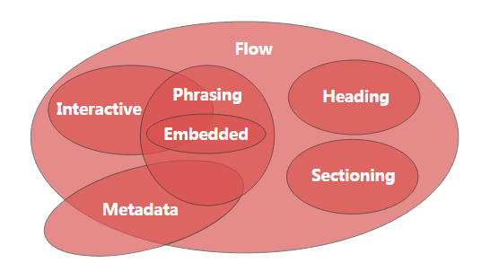
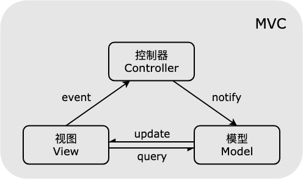
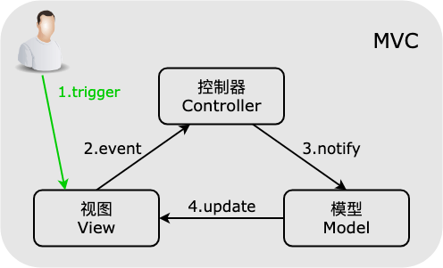
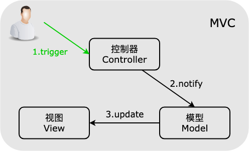
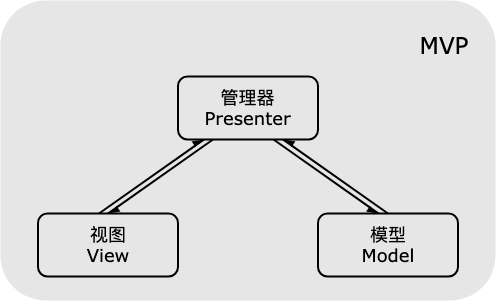
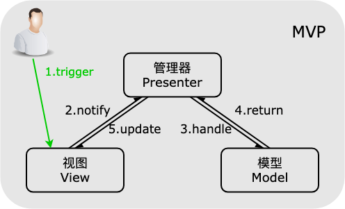
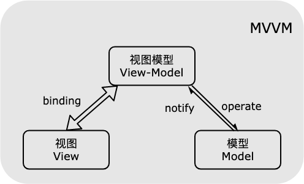
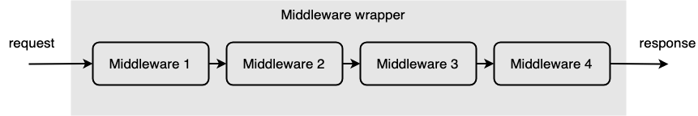
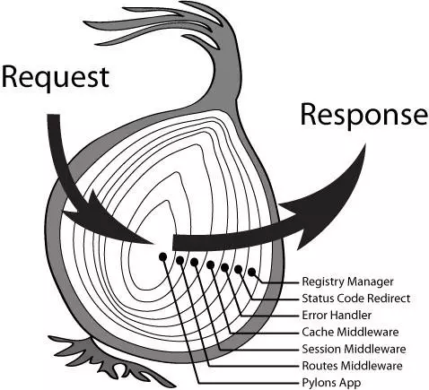

# Web 前端学习笔记

---

## 目录

---

### [HTML](#第一篇-html)

---

### [CSS](#第二篇-css)

- [全面系统讲解-CSS-从容面对日常使用-顺利搞定面试问答](#全面系统讲解-css-从容面对日常使用-顺利搞定面试问答)
  - [一-HTML-基础](#一-html-基础)
    - [1-1-head-区元素](#1-1-head-区元素)
    - [1-2-body-区元素](#1-2-body-区元素)
    - [1-3-HTML5-新增](#1-3-html5-新增)
    - [1-4-元素分类](#1-4-元素分类)
    - [1-5-元素嵌套关系](#1-5-元素嵌套关系)
    - [1-6-元素默认样式](#1-6-元素默认样式)
  - [二-CSS-基础](#二-css-基础)
    - [2-1-选择器分类](#2-1-选择器分类)
    - [2-2-选择器权重](#2-2-选择器权重)
    - [2-3-非布局样式](#2-3-非布局样式)
      - [2-3-1-字体](#2-3-1-字体)
      - [2-3-2-行高](#2-3-2-行高)
      - [2-3-3-背景](#2-3-3-背景)
      - [2-3-4-边框](#2-3-4-边框)
      - [2-3-5-滚动](#2-3-5-滚动)
      - [2-3-6-文本折行](#2-3-6-文本折行)
      - [2-3-7-装饰性属性](#2-3-7-装饰性属性)
      - [2-3-8-Hack](#2-3-8-hack)
      - [2-3-9-思维扩展-使用纯-CSS-实现可折叠目录树效果](#2-3-9-思维扩展-使用纯-css-实现可折叠目录树效果)
  - [三-CSS-布局](#三-css-布局)
    - [3-1-table-布局](#3-1-table-布局)
      - [3-1-1-传统-table-布局](#3-1-1-传统-table-布局)
      - [3-1-2-使用-display-设置元素以-table-样式显示](#3-1-2-使用-display-设置元素以-table-样式显示)
      - [3-1-3-一些布局属性补充](#3-1-3-一些布局属性补充)
    - [3-2-flexbox-布局](#3-2-flexbox-布局)
    - [3-3-float-布局](#3-3-float-布局)
    - [3-4-inline-block-布局](#3-4-inline-block-布局)
    - [3-5-响应式布局](#3-5-响应式布局)
    - [3-6-CSS-布局常见问题](#3-6-css-布局常见问题)
      - [3-6-1-怎样实现两栏或三栏布局](#3-6-1-怎样实现两栏或三栏布局)
      - [3-6-2-absolute-和-fixed-的区别](#3-6-2-absolute-和-fixed-的区别)
      - [3-6-3-inline-block-的间隙](#3-6-3-inline-block-的间隙)
      - [3-6-4-清除浮动](#3-6-4-清除浮动)
      - [3-6-5-如何适配移动端页面](#3-6-5-如何适配移动端页面)
  - [四-CSS-效果](#四-css-效果)
    - [4-1-box-shadow](#4-1-box-shadow)
    - [4-2-text-shadow](#4-2-text-shadow)

---

### [JavaScript](#第三篇-javascript)

- [JavaScript-设计模式精讲](#javascript-设计模式精讲)
  - [一-创建型模式](#一-创建型模式)
    - [1-1-单例模式](#1-1-单例模式)
    - [1-2-简单工厂模式](#1-2-简单工厂模式)
    - [1-3-抽象工厂模式](#1-3-抽象工厂模式)
    - [1-4-建造者模式](#1-4-建造者模式)
  - [二-结构型模式](#二-结构型模式)
    - [2-1-代理模式](#2-1-代理模式)
    - [2-2-享元模式](#2-2-享元模式)
    - [2-3-适配器模式](#2-3-适配器模式)
    - [2-4-装饰者模式](#2-4-装饰者模式)
    - [2-5-外观模式](#2-5-外观模式)
    - [2-6-组合模式](#2-6-组合模式)
    - [2-7-桥接模式](#2-7-桥接模式)
  - [三-行为型模式](#三-行为型模式)
    - [3-1-发布订阅模式](#3-1-发布订阅模式)
    - [3-2-策略模式](#3-2-策略模式)
    - [3-3-状态模式](#3-3-状态模式)
    - [3-4-模板方法模式](#3-4-模板方法模式)
    - [3-5-迭代器模式](#3-5-迭代器模式)
    - [3-6-命令模式](#3-6-命令模式)
    - [3-7-职责链模式](#3-7-职责链模式)
    - [3-8-中介者模式](#3-8-中介者模式)
  - [四-其他模式](#四-其他模式)
    - [4-1-MVC-模式](#4-1-mvc-模式)
    - [4-2-MVP-模式](#4-2-mvp-模式)
    - [4-3-MVVM-模式](#4-3-mvvm-模式)
    - [4-4-模块模式解决方案](#4-4-模块模式解决方案)
    - [4-5-链模式](#4-5-链模式)
    - [4-6-中间件](#4-6-中间件)

---

## 第一篇-HTML

---

## 第二篇-CSS

---

### 全面系统讲解-CSS-从容面对日常使用-顺利搞定面试问答

#### 一-HTML-基础

##### 1-1-head-区元素

页面信息的描述和资源，不会直接出现在页面上

- meta

  ```html
  <meta charset="utf-8" />
  ```

  ```html
  <meta
    name="viewport"
    content="width=device-width,maximum-scale=1.0,minimum-scale=1.0,user-scalable=no"
  />
  ```

- title
- style
- link
- script
- base

  ```html
  <base href="/" />
  ```

  指定页面或框架中链接的基础路径

##### 1-2-body-区元素

- div / section / article / aside / header / footer
- p
- span / em / strong
- table[rowspan,colspan] / thead / tbody / tr / td[rowspan,colspan]
- ul / ol / li / dl / dt / dd
- a[href,target]
- form[target,method,enctype] / input[type,value] / label[for] / select>option[value] / textarea / button[type]
- img[src,alt]

##### 1-3-HTML5-新增

- 新区块标签：
  - section
  - article
  - nav
  - aside
- 表单增强：
  - 日期、时间、搜索
  - 表单验证
  - Placeholder, 自动聚焦
- 语义：
  - header / footer: 头尾
  - section / article: 区域
  - nav: 导航
  - aside: 边栏、广告、不重要内容
  - em / strong: 强调
  - i: icon, 用于图标

##### 1-4-元素分类

- 按默认样式：

  - 块级 block
  - 行内 inline
  - inline-block

- 按内容：

  

##### 1-5-元素嵌套关系

- 块级元素可以包含行内元素

- 块级元素不一定能包含块级元素

  例如 p 里面不能再包含 div

- 行内元素一般不能包含块级元素

  例如 a 里面可以再包含 div

  对于 a 元素，在计算元素嵌套关系时可以直接去掉

##### 1-6-元素默认样式

不同浏览器元素默认样式存在差异，常用 reset 方法：

1. CSS Resets
2. Normalize.css

#### 二-CSS-基础

##### 2-1-选择器分类

- 元素选择器
- 伪元素选择器
- 类选择器
- 属性选择器
- 伪类选择器
- ID 选择器
- 组合选择器
- 否定选择器
- 通用选择器

##### 2-2-选择器权重

- ID 选择器 +100
- 类 / 伪类 选择器 +10
- 元素 / 伪元素 选择器 +1
- 其他选择器 +0
- 计算权重不进位
- **!important** 权重最高
- 元素属性上的样式 优先级更高
- 相同权重，后写的生效

##### 2-3-非布局样式

###### 2-3-1-字体

- 字体族：衬线字体 / 非衬线字体

- 多字体：fallback 机制

- 使用网络字体和自定义字体

- iconfont

  > font-family: （适用平台少的，特殊的字体），（适用平台广的，通用的字体），（字体族），例如：

  ```html
  font-family: "PingFang SC", "Microsoft Yahei", monospace;
  ```

  > 平方字体是苹果系统默认使用的，而微软雅黑在部分苹果系统上也有安装，如果先写微软雅黑，导致部分苹果系统将使用微软雅黑而不是苹果系统上效果更好的平方字体，最后写字体族，利用 fallback 机制在前面两种字体都不支持的情况下自动从指定字体族中选用一种
  >
  > @font-face 使用自定义字体或者网络字体，例如：

  ```html
  @font-face{ ​ font-family: (名字自己起); ​ src:(本地文件路径或者网络地址); }
  ```

  > 网络字体一般都提供 CSS 文件直接远程引入，其中已经使用@font-face 定义好了 font-family，可以直接拿来使用

  ```html
  <link rel="stylesheet" href="http://www.xxx.com/xxx.css" />
  ```

###### 2-3-2-行高

- 行高是由 line-box 决定的，而 line-box 是由 inline-box 构成的

  > 例如： 设置 inline-height 不会影响文字布局的高度，文字的高度由字体大小决定，但是会撑起外部容器的高度

  ```html
  <div>
    <span>inline-box</span><span>inline-box</span><span>inline-box</span>
  </div>
  ```

  > 三个 span 元素分别设置 line-height 为 20、24、30，实际效果上，文字全部是高度相同并且对齐的，因为文字排版默认以 base-line 对齐但是外部 div 元素的高度是 30，也就是被三个 span 中 line-height 最高的那个 span 给撑起来

- 利用 line-height 的特性，当 line-height 值大于字体大小时，多处的高度将会平均分布到 inline-box 的上下，撑起 line-box，因此可以不设置外部容器的高度，而通过指定 line-height 来撑起容器，此时容器内的文字自然是垂直居中的
  > 如果同一个 line-box 中不同的 inline-box 的文字大小不同，那么表现出来的是文字不是在容器中垂直居中的，因为文字默认对齐方式是按 base-line(基线对齐)，可以通过设置 vertical-align 来改变，比如设置为：vertical-align:middle
  >
  > vertical-align 如果设置具体的 px 值，则是将 inline-box 以 base-line 为参照进行偏移
  >
  > 当容器中同时有文字和图片时，会发现图片边缘不是和文字对齐的，而是有一条缝隙，这是因为 img 元素默认也是以 base-line 进行对齐，此时只需将 vertical-align 设置成 bottom 就可以消除这条缝隙

###### 2-3-3-背景

- background-size 对于渐变也是适用的

  > 利用渐变和 background-size,background-repeat 可以生成类似网格的效果，例如：

  ```html
  .demo{ background:linear-gradient(135 deg,transparent 0,transparent
  49.5%,green 49.5%,green 50.5%,transparent 50.5%,transparent 100%); }
  ```

  > 这会生成一条斜向上的绿色斜线，然后可以通过 background-size 将这条斜线设置成很小很短的一条，之后使用 background-repeat 设置重复，以同样方法在生成斜向下的线条，叠加起来就成了网格背景。相比使用一张网格背景图片，这种方式能减少 http 请求次数，提高网页性能

- 雪碧图

  雪碧图将多张小图片合并成一张图片，可以有效减少 http 请求优化网页性能，其原理也是利用 background 的 background-position、background-size 属性

- 移动端适配

  利用 background-size 属性将一张大图缩小再作为背景使用，就是移动端高清屏(retina)或者说@2x 图解决方案

- base64 格式图片

  将图片转换成 base64 格式的字符串，可以节省 http 请求，但是会增大文件体积，并且增加解码开销，适用于小尺寸的图标类的场景

###### 2-3-4-边框

- 边框背景图

  可以使用图片作为边框，此时边框样式必须是 solid，例如：

  ```html
  .demo{ border:30px solid transparent; border-image:url(./border.png) 30 round;
  }
  ```

  > border-image 中 30 是设置边框四个角上的图案大小，around(或者 repeat)设置四个角中间是由图案填充，不设置则中间图案会变成拉伸

- 三角形

  边框交界的地方是呈 45 度角的，利用这一点可以使用边框生成三角形，例如：

  ```html
  .demo{ width:0; height:0; border:30px solid transparent; border-bottom:30px
  solid #f00; }
  ```

  > 改变不同方向边框的宽度就可以改变三角形的形状

###### 2-3-5-滚动

- 滚动容器和滚动条(overflow 属性)

  - visible:超出容器的内容会直接显示出来，隐藏滚动条
  - hidden:超出容器的内容不会显示，隐藏滚动条
  - scroll:超出容器的内容可以滚动显示，始终显示滚动条
  - auto:超出容器的内容可以滚动显示，默认隐藏滚动条，只有当内容超出需要滚动显示时才出现滚动条

###### 2-3-6-文本折行

- overflow-wrap(word-wrap)

  通用换行控制，控制是否保留单词，主要适用于文本中含有超长单词的情况

- word-break

  是把单词看做一个单位还是把字母看做一个单位，主要针对多字节文字的情况

  > 针对 CJK(中日韩三国语言)的情况，将单词看做一个单位实际上是以句子为单位，而将字母看做一个单位实际上是以单个汉字为单位

- white-space

  控制在空白处是否换行，因为英文单词是以空格分隔的

  > 将 white-space 设置为 nowrap 就可以实现很长的一段文本不换行

###### 2-3-7-装饰性属性

- font-weight:字重(粗体)
- font-style:斜体
- text-decoration:下划线
- cursor:鼠标样式

###### 2-3-8-Hack

Hack 就是不合法但是生效的写法，主要用于处理浏览器兼容性问题，对特定浏览器做对应的特定处理，具有难维护、难理解、易失效的缺点

> hack 的替代方案主要是使用特性检测，对于 CSS 的 hack 写法可以针对性的加 class
>
> hack 属性应该写在标准属性的后面，这样才能利用 hack 写法的特点针对特定浏览器实现特定效果

###### 2-3-9-思维扩展-使用纯-CSS-实现可折叠目录树效果

思路:结合:checked 伪类，相邻兄弟选择器+，后续兄弟选择器~等等

```html
<head>
  <style>
    ul {
      color: white;
      background-color: black;
    }
    li.level {
      position: relative;
    }
    label {
      position: absolute;
      left: 60px;
      display: inline-block;
      width: 10px;
      text-align: center;
      cursor: pointer;
    }
    label.open {
      display: none;
    }
    input[type="radio"] {
      display: none;
    }
    input.close:checked + label.open {
      display: inline-block;
    }
    input.close:checked ~ ul.subList {
      display: block;
    }
  </style>
</head>
<body>
  <div>
    <ul>
      <li class="level">
        Level1-1
        <label for="level1-1-close">+</label>
        <input type="radio" id="level1-1-close" class="close" name="level1-1" />
        <label for="level1-1-open" class="open"> - </label>
        <input type="radio" id="level1-1-open" name="level1-1" />
        <ul class="subList">
          <li class="level">Level2-1</li>
          <li class="level">Level2-2</li>
        </ul>
      </li>
      <li class="level">Level1-2</li>
    </ul>
  </div>
</body>
```

#### 三-CSS-布局

CSS 布局从发展历程来看，主要有早期的 table 布局，但是 table 元素早期浏览器并不会对其进行流式加载(现今已不是问题，浏览器都会对 table 进行流式加载，使用 table 布局已经不会有什么问题，主要还是语义不清，因为 table 本身是用于呈现数据的表单元素)，对于内容很长的 table，会造成页面堵塞；之后为了解决 table 布局的问题，开始使用各种技巧性布局(比如 float 加 margin 的经典应用，不论是两栏还是三栏都能很好的实现)，缺点是实现起来很难，写法复杂，因为这些技巧不是为布局而生的；再到如今开始使用 flexbox 和 grid，专为布局而生，实现简单而且效果很好。另外现今移动端大行其道，对于移动端要使用响应式布局。

##### 3-1-table-布局

###### 3-1-1-传统-table-布局

```html
<head>
  <style>
    table {
      width: 800px;
      height: 200px;
      border-collapse: collapse;
    }
    .left {
      background-color: red;
    }
    .right {
      background-color: blue;
    }
  </style>
</head>
<body>
  <table>
    <tr>
      <td
        class="left>Left</td>
      <td class="
        right
      >
        Right
      </td>
    </tr>
  </table>
</body>
```

> 单元格中的文字会自动垂直居中，而且要改变左右两栏的比例，只需要简单的对其中一个单元格设置宽度，另一栏宽度会自适应变化。

###### 3-1-2-使用-display-设置元素以-table-样式显示

```html
<head>
  <style>
    .left {
      background-color: red;
    }
    .right {
      background-color: blue;
    }
    .table {
      display: table;
      width: 800px;
      height: 200px;
    }
    .table-cell {
      display: table-cell;
      vertical-align: middle;
    }
    .table-row {
      display: table-row;
    }
  </style>
</head>
<body>
  <div class="table">
    <div class="table-row">
      <div class="table-cell left">Left</div>
      <div class="table-cell right">Right</div>
    </div>
  </div>
</body>
```

###### 3-1-3-一些布局属性补充

- inline-block

  inline-block 元素对内表现得像 block，可以设置宽高，对外表现得像 inline，不会独占一行而是并排显示，在折行处会整个换行而不会打断内部内容，可以通过设置 vertical-align 来改变垂直对齐方式

- static,relative,absolute,fixed

  static 是浏览器默认的布局方式，称为静态布局，元素位于正常文档流中的位置；relative 会相对自身 static 时的位置进行偏移，并且偏移后仍然占据原来 static 时侯文档中的位置；absolute 则会脱离文档流，不会对其他元素的布局造成影响，而且其偏移是相对于距离自己最近的 relative 或 absolute 的父级元素，或者没有就相对于 body；fixed 则是相对于浏览器可是区域进行定位，脱离文档流。当多个元素层叠在一起是，默认按出现在文档流中的顺序重叠，也可以设置 z-index 手动改变叠加顺序

##### 3-2-flexbox-布局

flexbox 称为弹性盒子，具有可伸缩性，而且本来就是并列的，不用使用 float 或 inline-block 的方式手动设置，同时对宽度提供了多种控制方式，是专为布局而生

> 比如要实现两栏布局，左边定宽，右边宽度自适应，只需要指定父元素 display:flex;然后指定左边定宽元素的宽度，然后右边元素指定 flex:1 就可以实现，简单方便
>
> 使用 flexbox 需要注意浏览器兼容性问题

##### 3-3-float-布局

- float 的元素会脱离**文档流**，但是不会脱离**文本流**

  > 元素设置 float 后，不再占据原来文档流中的位置，因此不会对其他元素的布局造成影响。但是会占据其他元素中文字的布局，即所谓“不会脱离文本流”，究其原因是因为 float 本身是为了用于图文混排的，类似 word 文档中插入图片后可以设置图片周围的文字样式，比如环绕图片

- float 的元素自身会形成一个“块”，即 BFC(block format context 块级格式上下文)

  > BFC 带来的特性，一是可以为该元素设置宽高，二是该元素位置会尽量靠上，在尽量靠上的前提下，float:left 会尽量靠左、float:right 会尽量靠右。注意是尽量，可以参考图文混排的情况理解。

- float 的元素对兄弟元素的影响

  > 上面一般贴非 float 元素，左右一般贴 float 元素，不影响其他块级元素的位置，影响其他块级元素内部文本

- float 的元素对父级元素的影响

  > 对于父级元素来说，float 元素相当于“消失”了，因此可能引起父级元素高度塌陷
  >
  > 解决高度塌陷的常用方法，一是使父级元素也形成 BFC，比如为其设置 overflow 属性，二是清除浮动：

  ```css
  .clear-float::after {
    display: block;
    content: "";
    height: 0;
    visibility: hidden;
    clear: both;
  }
  ```

- 使用 float 实现两栏或三栏经典布局

  > 原理是结合 float 和 margin

  ```html
  <head>
    <style>
      .container {
        width: 800px;
        height: 200px;
      }
      .left {
        float: left;
        width: 200px;
        height: 100%;
      }
      .right {
        margin-left: 200px;
        height: 100%;
      }
    </style>
  </head>
  <body>
    <div class="container">
      <div class="left">Left</div>
      <div class="right">Right</div>
    </div>
  </body>
  ```

  ```html
  <head>
    <style>
      .container {
        width: 800px;
        height: 200px;
      }
      .left {
        width: 200px;
        height: 100%;
      }
      .right {
        width: 200px;
        height: 100%;
      }
      .middle {
        margin-left: 200px;
        margin-right: 200px;
        height: 100%;
      }
    </style>
  </head>
  <body>
    <div class="container">
      <div class="left">Left</div>
      <div class="right">Right</div>
      <div class="middle">Middle</div>
    </div>
  </body>
  ```

  > 类似上面的两栏或三栏布局，也可以使用 position:absolute 加 margin 来实现，但是 absolute 的元素高度需要显示指定，设置 height:100%不会直接继承父元素高度，因为 absolute 是相对与最近的 relative 或 absolute 父级元素，或者没有就相对于 body。另外 absolute 完全脱离文档流和文本流，缺少一些适应性方面的特性，所以很少使用 absolute 方式

##### 3-4-inline-block-布局

inline-block 可以是块级元素像文本一样并排起来，而且没有清除浮动等问题，但是需要处理间隙

> 出现间隙是因为 inline-block 把块级元素对外展现为 inline，即文本的方式，而文字之间是有间隙的
>
> 去除间隙的方法就是在父级元素上设置 font-size:0，然后在自身上面单独指定 font-size
>
> 还有一种不常用的方式，即间隙其实来自 html 文件中 inline-block 元素的标签之间有空格、换行之类的空白，所以只要去除标签之间的空白(可以将标签连起来写在一行，或者将空白的地方用 html 注释注释掉)，就可以去除间隙

inline-block 布局对于自适应的场景不太适合，一般应用与定宽度的场合

##### 3-5-响应式布局

响应式布局主要解决不同设备上正常使用的问题，包括很多方面，比如是否有鼠标键盘输入，是否有屏幕阅读器等等，但是一般场合下主要关注屏幕大小问题。

要解决不同屏幕大小适配问题，首先要从源头做起，即确定设计稿时，应该使用隐藏+折叠+自适应空间的方式设计页面，而不是所有元素直接定宽写死

常用手段如下：

> rem:字体大小以 html 元素的字体大小为基准进行计算，针对不同屏幕设定不同的 html 元素的 font-size 即可
>
> viewport:视口大小，通过 js 设置 viewport 来让页面缩放到合适的大小
>
> media query:媒体查询，可以针对不同的屏幕尺寸写不同的样式

- 适配移动端页面

  - 第一步就是指定 viewport，使页面宽度匹配移动端屏幕的宽度

    ```html
    <head>
      <meta
        name="viewport"
        content="width=device-width,initial-scale=1.0,maximum-scale=1.0,minimum-scale=1.0,user-scalable=no"
      />
    </head>
    ```

  - 第二步，使用 media query 媒体查询，将不重要的内容在移动端上隐藏或折叠，腾出空间

    ```css
    @media (max-width: 640px) {
      .left {
        display: none;
      }
    }
    ```

    > 使用 media query 要注意，大的匹配范围要写到前面，小的适配范围要写到后面
    >
    > 比如先匹配 iphone6 的 375px，再匹配 iphone5 的 320px

> 可以使用固定的 viewport 中 width 的值，让页面在不同尺寸屏幕间进行等比例缩放
>
> 比如设置 width=320，就是以 iphone5 的屏幕大小为基准进行布局，然后在不同尺寸屏幕上将所有元素等比例缩放进行适配
>
> 也可以使用 rem 的方式进行适配，即针对不同屏幕尺寸设置不同的 html 的 font-size 值，然后页面中所有要适配的元素，单位都改成 rem
>
> 使用 rem 很多时候会算出小数，所以不能精确匹配像素，实际使用是要注意预留余地，或者不要在精确度要求高的场合使用

##### 3-6-CSS-布局常见问题

###### 3-6-1-怎样实现两栏或三栏布局

四种常用方式：

1. table 布局
2. float+margin 布局
3. inline-block 布局
4. flexbox 布局

###### 3-6-2-absolute-和-fixed-的区别

1. absolute 是相对于最近的 relative 或 absolute 父级元素，或者没有就相对于 body
2. fixed 是相对于屏幕，移动端是相对于 viewport(视口)，fixed 在早期移动端的表现不太好，所以如果要兼容比较老的移动端，要慎用 fixed

###### 3-6-3-inline-block-的间隙

1. 产生原因是对外表现为 inline 元素，而 inline 元素有字符间距
2. 解决办法是消灭字符或消除字符间距：
   1. 在 html 文件中标签之间不要有空白字符
   2. 父级元素上设置 font-size:0，在自身上面指定 font-size

###### 3-6-4-清除浮动

1. 为什么要清除浮动？

   因为父元素不会管浮动的元素，因此浮动元素可能会超出父元素而对其他元素造成影响

2. 怎样清除浮动？=> 让盒子负责自己的布局
   1. 使父元素形成 BFC，比如设置 overflow 属性
   2. 使用伪元素::after，设置 clear:both

###### 3-6-5-如何适配移动端页面

1. 指定 viewport
2. 使用 rem/viewport/media query
3. 在设计上，充分使用隐藏、折叠、自适应空间

#### 四-CSS-效果

##### 4-1-box-shadow

box-shadow: x 轴方向偏移距离 y 轴方向偏移距离 模糊大小 扩展大小 阴影颜色 内阴影;

- 只设置扩展值，偏移和模糊为零，则形成边框；扩展值为负数时，阴影会缩小但是不会消失。设置扩展值，偏移值，模糊设为零，可以达到复制元素的效果

- box-shadow 的形状和盒子本身的形状一样，就是说可以通过 border-radius 来改变 box-shadow 的形状，因此通过设置偏移、扩展、颜色，再加上 border-radius，并且添加多个 box-shadow，可以实现非常复杂的图案

box-shadow 的主要应用场景，一是营造立体感，而是充当没有宽度的边框。

box-shadow 也可以实现一个元素做出复杂图案的效果

##### 4-2-text-shadow

text-shadow 的主要作用，一是营造立体感，而是实现印刷品质感，即类似纸张印刷文字的视觉效果

> 印刷品质感的参考写法：

```css
.demo {
  text-shadow: 0 0 1px rgba(128, 128, 128, 0.2);
}
```

---

## 第三篇-JavaScript

---

### JavaScript-设计模式精讲

#### 一-创建型模式

##### 1-1-单例模式

游戏的存档，每次玩游戏都可以拿到同一个存档继续玩，而不是从头再来

##### 1-2-简单工厂模式

下馆子吃饭，只要点好菜就可以吃到想吃的东西，厨师会按照菜名做好菜，消费者不需要知道每道菜是怎么做出来的

##### 1-3-抽象工厂模式

肚子饿了，只要去饭馆就能吃到东西，不管是哪一家馆子，进去之前就知道。点了炒菜可以吃，不管时回锅肉还是红烧排骨，点了汤可以喝，不管是菠菜汤还是番茄汤，食物上桌之前就知道

##### 1-4-建造者模式

生产一台汽车，汽车厂只需要制定各个部件的规格并且完成装配过程，部件的生产由部件生厂商完成

#### 二-结构型模式

##### 2-1-代理模式

找明星拍广告，无法直接接触到明星，只能先和经纪人谈，只有和经纪人谈好合约之后，明星才会到片场开拍

##### 2-2-享元模式

驾考现场的考试车，不是每个考生都有一辆而是多个考生公用一辆，根据当天考生数量增加或减少类型的考试车，优化驾考场地资源消耗

##### 2-3-适配器模式

不同国家提供的电源插孔规格不一样，同一部手机，去不同国家使用，只需要搭配对应的电源适配器，不需要换手机

##### 2-4-装饰者模式

给新房子装修，毛坯房建好就已经可以居住了，装修只是让房子住起来跟舒服更符合个人需求，但是住人的基本功能是不变的

##### 2-5-外观模式

遥控无人机，无人机由非常多的子模块构成，比如飞行控制器、电子调速器、电机、数字电传、陀螺仪和加速度计等等。即使实现一个简单的飞行动作也需要各个子模块相互进行复杂的调用，无人机玩家不可能完全掌握如此复杂的操作，因此制造商使用统一的遥控器简化无人机的操作，玩家只需要使用遥控器上的上下左右前后和左转右转就可以操作无人机，因此遥控器就相当于无人机的外观

##### 2-6-组合模式

文档结构树，文件夹下面可以继续包含子文件夹，也可以包含文件，子文件夹又可以包含文件夹或者文件，以此类推，层层递进构成文档结构树。文件夹因为既能包含子文件夹又能包含文件，因此称为容器节点，或者组合对象；文件相当于树形结构的末端，因此称为叶节点，或者页对象。当我们需要找到某个文件时，只需要在最上层文件夹上发送搜索命令，就可以沿着树形结构层层递进，直到找到文件或遍历完整棵树

##### 2-7-桥接模式

组装变频洗衣机，变频洗衣机都是由电机、滚筒和变频器组成，但是不同型号所使用的部件规格不一样。将电机、滚筒、变频器作为抽象维度，在组装变频洗衣机实例时，抽象维度的三个部件实际的规格可以各自独立改变，从而组装成不同型号的变频洗衣机

> 例如，产品经理要求实现一个按钮样式，默认前景黑色背景浅灰色，当鼠标 mouseover 时，前景蓝色背景绿色尺寸 1.5 倍，当鼠标 mouseleave 时还原，当鼠标按下时前景红色背景紫色尺寸 0.5，鼠标抬起时还原。那么我们可以将设置前景后景颜色和设置尺寸抽象成两个构成按钮样式的抽象维度，对应定义两个桥接函数，然后根据需求在指定事件上对桥接函数传参就可以实现产品需求。利用桥接模式将抽象部分和实现部分分离，使两个维度可以独立变化，降低耦合。

#### 三-行为型模式

##### 3-1-发布订阅模式

去商店买鞋，看中的款式刚好售罄，店员告诉你很快会到货，到时通知你，于是你留下电话号码。当你留下电话后就可以不再管这件事，直到某天该款式到货时，店员拿出小本本，照着上面的电话名单一一通知客户，你接到通知后再决定是否要去商店将鞋买回来

##### 3-2-策略模式

多功能螺丝刀，一把螺丝刀把配多个螺丝刀头，针对不同的使用场合安装对应的螺丝刀头即可

##### 3-3-状态模式

交通灯，红绿黄三种颜色代表交通灯的三种内部状态，不同的状态下交通灯的外部行为逻辑不一样，行为逻辑和内部状态间具有较强的对应关系

> 例如，如果不使用设计模式，要实现如上面交通灯的功能，需要使用 switch-case 或者 if-else 语句，当逻辑复杂时，这种写法非常容易出错，而且很难扩展。使用状态模式，可以将状态和对应的行为抽象出来进行封装，这样代码结构清晰而且方便扩展：

```javascript
class AbstractState {
  constructor() {
    if (new.target === AbstractState) {
      throw new Error("抽象类不能实例化！");
    }
  }
  employ() {
    throw new Error("抽象方法不能调用！");
  }
  changeState() {
    throw new Error("抽象方法不能调用！");
  }
}
class RedState extends AbstractState {
  constructor() {
    super();
    this.colorState = "红色";
  }
  employ() {
    console.log(`交通灯颜色变为${this.colorState}，行人通行&车辆等待！`);
  }
  changeState(trafficLight) {
    trafficLight.setState(trafficLight.yellowState);
  }
}
class GreenState extends AbstractState {
  constructor() {
    super();
    this.colorState = "绿色";
  }
  employ() {
    console.log(`交通灯颜色变为${this.colorState}，行人等待&车辆通行！`);
  }
  changeState(trafficLight) {
    trafficLight.setState(trafficLight.redState);
  }
}
class YellowState extends AbstractState {
  constructor() {
    super();
    this.colorState = "黄色";
  }
  employ() {
    console.log(`交通灯颜色变为${this.colorState}，行人等待&车辆等待！`);
  }
  changeState(trafficLight) {
    trafficLight.setState(trafficLight.greenState);
  }
}
class TrafficLight {
  constructor() {
    this.redState = new RedState();
    this.greenState = new GreenState();
    this.yellowState = new YellowState();
    // 蓝灯状态：this.blueState=new BlueState()
    this.state = this.greenState;
    // 起始状态为蓝灯状态： this.state=this.blueState
  }
  setState(state) {
    state.employ();
    this.state = state;
  }
  changeState() {
    this.state.changeState(this);
  }
}
const light = new TrafficLight();
// 增加蓝灯状态后，light.changeState() 输出：交通灯变为绿色，行人等待&车辆通行！
light.changeState(); // 输出：交通灯颜色变为红色，行人通行&车辆等待！
light.changeState(); // 输出：交通灯颜色变为黄色，行人等待&车辆等待！
light.changeState(); // 输出：交通灯颜色变为绿色，行人等待&车辆通行！
/*
  增加蓝灯状态
  class BlueState extends AbstractState{
    constructor(){
      super()
      this.colorState='蓝色'
    }
    employ(){
      console.log(`交通灯颜色变为${this.colorState}，行人停在马路中间&车辆停在马路中间！`)
    }
    changeState(trafficLight){
      trafficLight.setState(trafficLight.greenState)
    }
  }
*/
```

##### 3-4-模板方法模式

咖啡厅制作咖啡，有一套固定的流程，例如先把水煮沸，然后温杯墨粉，之后冲煮咖啡，最后加入调味料。不同的咖啡只是改变每个步骤的细节，比如水温、冲煮器具、是否加水稀释/加牛奶奶泡/加肉桂粉/加糖等等。

##### 3-5-迭代器模式

点钞机，放入点钞机的钞票具有不同的版次和不同的冠字号，使用者不关心这些细节，只在乎钞票的数量以及是否有假币

> ES6 使用数据结构的 Symbol.iterator 属性来部署迭代器，凡是具有 Symbol.iterator 属性并且返回值符合迭代器对象的，都可以使用 for...of 进行遍历，不论内部是怎样的结构

```javascript
const test = {
  [Symbol.iterator]() {
    let count = 0;
    return {
      next: function () {
        return count < 10
          ? {
              value: count++,
            }
          : {
              done: true,
            };
      },
    };
  },
};
for (const val of test) {
  console.log(val); // 输出：0 1 2 3 4 5 6 7 8 9
}
```

##### 3-6-命令模式

宿舍关灯，晚上睡觉前，大家都上床了，有人说了一声“谁去把灯关了”，说话的人并不需要指定说给谁听，也不需要关心最后是谁下床去关灯的，关灯的人也不在乎是谁说的话

> 例如链接中的案例，要移动超级玛丽，可以将上下左右和撤销/重做命令的逻辑独立出来，然后将按钮触发的相应事件和对应命令绑定，在命令的中来绑定移动的人物，这样解耦命令发出者和命令接收者，加入要按钮要移动的是怪物而不是超级玛丽，只需要再创建怪物角色，然后在命令中将绑定对象改为怪物便可以了。如果不使用命令模式，将按钮的回调事件和具体角色直接绑定，一旦需要修改命令发出者或者命令接收者，便需要同时改动多个地方。[超级玛丽](https://codepen.io/SHERlocked93/pen/QeZoKv?editors=1010)

##### 3-7-职责链模式

向领导请假两天，先请示小组领导得到回答只能批准半天内的，然后请示部门领导得到回答只能批准一天内的，最后请示总经理得到批准，一开始提出申请时并不确定哪个领导能批准，申请会沿着职级一级级往上请示

> 职责链模式和区别于命令模式在于命令的传递具有顺序，并且可以通过改变职责链上的节点来控制命令的传递顺序，命令发出者虽然仍然和命令接收者解耦，但是命令的传递过程是具有规律的

```javascript
class AbstractLeader {
  constructor() {
    if (new.target === AbstractLeader) {
      throw new Error("The abstract class cannot be instantiated!");
    }
    this.nextLeader = null;
  }
  setNext(leader) {
    this.nextLeader = leader;
    return leader;
  }
  handle() {
    throw new Error("The abstract method cannot be called!");
  }
}
class GroupLeader extends AbstractLeader {
  constructor(name) {
    super();
    this.name = name;
  }
  handle(duration) {
    duration <= 0.5
      ? console.log(`小组领导${this.name}批准请假！`)
      : this.nextLeader.handle(duration);
  }
}
class DepartmentHead extends AbstractLeader {
  constructor(name) {
    super();
    this.name = name;
  }
  handle(duration) {
    duration <= 1
      ? console.log(`部门领导${this.name}批准请假！`)
      : this.nextLeader.handle(duration);
  }
}
class ManagingDirector extends AbstractLeader {
  constructor(name) {
    super();
    this.name = name;
  }
  handle(duration) {
    duration <= 2
      ? console.log(`总经理${this.name}批准请假！`)
      : console.log(`总经理${this.name}拒绝了请假申请！`);
  }
}
const wangGe = new GroupLeader("wangGe");
const liZhuRen = new DepartmentHead("liZhuRen");
const haHaHa = new ManagingDirector("haHaHa");
wangGe.setNext(liZhuRen).setNext(haHaHa);
wangGe.handle(0.5); // 小组领导wangGe批准请假！
wangGe.handle(1); // 部门领导liZhuRen批准请假！
wangGe.handle(2); // 总经理haHaHa批准请假！
wangGe.handle(3); // 总经理haHaHa拒绝了请假申请！
```

##### 3-8-中介者模式

参加相亲活动，有很多家庭，不可能挨个去找其他家庭了解情况，而是所有参加的家庭把自身条件和择偶标准告诉婚介，由婚介统一进行筛选匹配，然后再通知双方见面沟通

#### 四-其他模式

##### 4-1-MVC-模式

Model 模型层、View 视图层、Controller 控制器层。MVC 模式的目的是通过引入 Controller 来分离 Model 和 View。Model 负责业务数据的处理和存储，在数据更新后更新；View 负责人机交互接口，一般为展示给用户的界面；Controller 负责连接 Model 和 View，接受并处理 View 触发的事件，并且在 Model 的数据状态变动时更新 View。由于 Model 不仅用于数据存储，还负责数据处理，所以在某些场景下，View 可以通过发布-订阅模式监听 Model 上的变化，导致 Model 和 View 相互持有、相互操作、紧密耦合，可维护性仍然有待提升。

> 典型 MVC 模式如下图所示：
>
> 
>
> 用户操作 View 引起数据更新，如下图所示：
>
> 
>
> 用户直接操作 Controller 引起数据更新，如下图所示：
>
> 

##### 4-2-MVP-模式

Model 模型层、View 视图层、Presenter 管理层。MVP 模式的目的是将 Model 和 View 完全解耦，对 View 的修改不会影响 Model，对 Model 的修改也不会影响 View，Model 和 View 之间的交互只能通过 Presenter。View 层不布置任何业务逻辑，只负责数据展示和触发事件，其他时间都在等待 Presenter 来更新，所以被称为**被动视图**。由于 Presenter 负责数据获取、数据处理、交互逻辑、UI 效果等功能，因此变得强大起来，如果需要添加或者修改模块功能，只需要修改 Presenter，Model 和 View 则变得责任纯粹而单一，Model 只负责存储数据、View 只负责展示数据。由于 Presenter 需要调用 View 的方法来更新试图，Presenter 直接持有 View 导致对 View 的依赖，并且数据状态改变时，需要手动更新 View，对于大型项目手动更新视图可能是一系列复杂的过程。

> 典型 MVP 模式如下图所示：
>
> 
>
> 用户操作 View 引起数据更新，如下图所示：
>
> 

##### 4-3-MVVM-模式

Model 模型层、View 视图层、View-Model 视图模型。与 MVP 模式类似，Model 和 View 完全解耦，View-Model 相当于 Presenter，负责绑定 Model 和 View，相比 Presenter 增加了双向绑定。双向绑定使得 View 层的变动自动反映在 View-Model，反之亦然。对于大型项目，双向绑定可以节约大量手动更新视图的复杂过程，但是双向绑定使得调试和错误定位变得困难，因为 View 层的问题可能源自 View 层也可能源自 Model 层，数据绑定使得一个位置的 Bug 被传递到其他位置，因此对于简单 UI 来说，实现 MVVM 模式的开销是不必要的。

> 典型的 MVVM 模式如下图所示：
>
> 

##### 4-4-模块模式解决方案

- 命名空间模式：创建一个全局对象，将所有变量和方法放入这个全局对象，这个全局对象起到命名空间一样的作用。目的是解决变量冲突，缺点一是如果命名空间结构复杂嵌套过多，调用的时候会变得非常冗长而且在解析的时候性能消耗变大，缺点二是安全性低，所有成员都可以被外部访问。

  ```javascript
  const myNameSpace = {};

  myNameSpace.param1 = "hello";
  myNameSpace.param2 = "world";
  myNameSpace.param3 = { prop: "hello world!" };

  myNameSpace.method = function () {
    console.log("hello world!");
  };
  ```

- 模块模式：利用闭包的特性，使用 IIFE 快速创建一个闭包，将要隐藏的变量和方法放入闭包中，在闭包外面无法访问这些变量和方法而称为私有成员，闭包返回的方法因为作用域的原因可以访问私有成员而称为特权方法。在模块模式创建时，还可以将参数传入闭包中，从而更自由的创建模块，而且可以将全局变量传入模块中，导入全局变量有助于加速模块中即时函数中全局符号的解析速度，因为全局变量成为了该函数的局部变量，缩短了作用域查找长度。

  ```javascript
  const myModule = (function () {
    let privateProp = "";
    function privateMethod() {
      console.log(privateProp);
    }
    return {
      publicProp: "public prop",
      publicMethod: function (prop) {
        privateProp = prop;
        privateMethod();
      },
    };
  })();

  myModule.privateProp; // 输出：undefined
  myModule.privateMethod(); // 输出：Uncaught TypeError:myModule.privateMethod is not a function
  myModule.publicProp; // 输出：public prop
  myModule.publicMethod("new private prop"); // 输出：new private prop
  ```

- 揭示模块模式：又被称作暴露模块模式，将模块模式稍加改动，在闭包中定义所有变量和方法，并返回一个匿名对象，需要供外部使用的变量和方法只需要赋值给所返回的匿名对象即可。使用该模式，所有变量和方法都成为私有成员，而被重命名后暴露出来的私有成员又可以供外部调用，保证安全性的同时又可以灵活的公开私有成员。

  ```javascript
  const myModule = (function () {
    let privateProp = "private prop";
    function privateMethod() {
      console.log(privateProp);
    }
    function setProp(prop) {
      privateProp = prop;
    }
    return {
      set: setProp,
      print: privateMethod,
    };
  })();

  myModule.privateProp; // 输出：undefined
  myModule.privateMethod(); // 输出：Uncaught TypeError:myModule.privateMethod is not a function
  myModule.print(); // 输出：private prop
  myModule.set("new private prop");
  myModule.print(); // 输出：new private prop
  ```

##### 4-5-链模式

在方法调用完成后返回一个对象，有时则直接返回 this，因此可以继续调用这个对象上的其他方法，这样可以在单行代码中连续调用多个方法，好像它们被串起来一样，这就是链式调用，也称为链模式。

> 假如我们需要创建如下所示的 DOM 树结构：

```html
<ul id="data-list">
  <li class="data-item">li-item 1</li>
  <li class="data-item">li-item 2</li>
  <li class="data-item">li-item 3</li>
</ul>
```

> 由于 setAttribute 方法没有返回值，appendChild 方法返回的时添加的节点，因此要完成上述 DOM 结构，需要多次反复调用 setAttribute 方法和 appendChild 方法，步骤零散，十分繁琐，可以使用链模式进行改造，如下所示：

```javascript
function createElement(tag, txt) {
  return tag === "text"
    ? document.createTextNode(txt)
    : document.createElement(tag);
}

HTMLElement.prototype._setAttribute = function (key, value) {
  this.setAttribute(key, value);
  return this;
};

HTMLElement.prototype._appendChild = function (child) {
  this.appendChild(child);
  return this;
};

const myList = createElement("ul")
  ._setAttribute("id", "data-list")
  ._appendChild(
    createElement("li")
      ._setAttribute("class", "data-item")
      ._appendChild(createElement("text", "li-item 1"))
  )
  ._appendChild(
    createElement("li")
      ._setAttribute("class", "data-item")
      ._appendChild(createElement("text", "li-item 2"))
  )
  ._appendChild(
    createElement("li")
      ._setAttribute("class", "data-item")
      ._appendChild(createElement("text", "li-item 3"))
  );

document.body.appendChild(myList);
```

##### 4-6-中间件

中间件就是一个执行特殊逻辑的函数，核心思想是在进入具体业务前进行一系列预处理，或者在结束具体业务逻辑后进行一系列后处理。中间件通常像管道连接一样被串联起来，通过使用中间件来简化和隔离基础设施和业务逻辑之间的细节，从而让开发过程专注于业务逻辑，而不需要对每个请求都进行特殊处理，提升开发效率。

> 典型的中间件应用示意图：
>
> 
>
> 著名的洋葱模型：
>
> 

---
