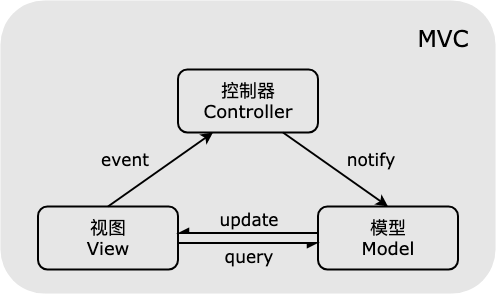
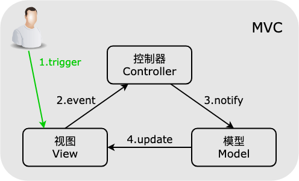
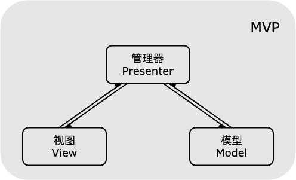

# JavaScript 设计模式精讲

## 目录

- [前言](#前言)
- [一-创建型模式](#一-创建型模式)
  - [1-1-单例模式](#1-1-单例模式)
  - [1-2-简单工厂模式](#1-2-简单工厂模式)
  - [1-3-抽象工厂模式](#1-3-抽象工厂模式)
  - [1-4-建造者模式](#1-4-建造者模式)
- [二-结构型模式](#二-结构型模式)
  - [2-1-代理模式](#2-1-代理模式)
  - [2-2-享元模式](#2-2-享元模式)
  - [2-3-适配器模式](#2-3-适配器模式)
  - [2-4-装饰者模式](#2-4-装饰者模式)
  - [2-5-外观模式](#2-5-外观模式)
  - [2-6-组合模式](#2-6-组合模式)
  - [2-7-桥接模式](#2-7-桥接模式)
- [三-行为型模式](#三-行为型模式)
  - [3-1-发布订阅模式](#3-1-发布订阅模式)
  - [3-2-策略模式](#3-2-策略模式)
  - [3-3-状态模式](#3-3-状态模式)
  - [3-4-模板方法模式](#3-4-模板方法模式)
  - [3-5-迭代器模式](#3-5-迭代器模式)
  - [3-6-命令模式](#3-6-命令模式)
  - [3-7-职责链模式](#3-7-职责链模式)
  - [3-8-中介者模式](#3-8-中介者模式)
- [四-其他模式](#四-其他模式)
  - [4-1-MVC-模式](#4-1-mvc-模式)
  - [4-2-MVP-模式](#4-2-mvp-模式)
  - [4-3-MVVM-模式](#4-3-mvvm-模式)
  - [4-4-模块模式解决方案](#4-4-模块模式解决方案)
    - [4-4-1-命名空间模式](#4-4-1-命名空间模式)
    - [4-4-2-模块模式](#4-4-2-模块模式)
    - [4-4-3-揭示模块模式](#4-4-3-揭示模块模式)
  - [4-5-链模式](#4-5-链模式)
  - [4-6-中间件](#4-6-中间件)

## 前言

如何理解设计模式？设计模式可以看做是先辈们总结出来的**最佳实践**。当遇到合适的场景时，套用恰当的设计模式可以达到事半功倍的效果，并且使项目代码组织结构合理，易于阅读理解和维护扩展。然后设计模式不应该生搬硬套，为了使用而使用反而会提升代码复杂度，是其他人难以理解，平白增加团队成员协作成本。

JavaScript 是多模式混合的，以原型为基础，并拥有动态数据类型。一方面将函数看做一等公民，允许函数式编程风格，另一方面，又不排斥传统的面向对象的开发方式，尤其是在 ES6 之后引入了面向对象相关的一些原生支持。因此，可以使用 JavaScript 来表达设计模式的理念和它所要解决的问题，帮助理解设计模式背后的核心思想。

我们将适用与 JavaScript 的设计模式分为三类：

- 创建型模式关注**如何创建对象**，主要特点是将对象的创建和使用分离，抽象了对象实例化的过程，用来帮助创建对象的实例，包括：

  - 单例模式：保证一个类只有一个实例，并提供一个访问它的全局访问点
  - 简单工厂模式：根据输入的不同返回不同类的实例，用来创建同一类对象
  - 抽象工厂模式：通过对类的工厂的抽象，是其业务用于对产品类簇的创建
  - 建造者模式：分步构建一个复杂对象，使得同样的构建过程可以采用不同的表示

- 结构型模式关注**如何将对象按某种布局组成更大的结构**，包括：

  - 代理模式：为目标对象创造一个代理对象，以控制对目标对象的访问
  - 享元模式：运用共享技术来有效地支持大量细粒度对象的复用，减少创建的对象的数量
  - 适配器模式：解决两个软件实体之间接口不兼容的问题
  - 装饰者模式：向一个现有的对象添加新的功能，同时又不改变其结构
  - 外观模式：为多个复杂的子系统提供一个一致的接口，是使这些子系统更加容易被访问
  - 组合模式：用小的子对象构建更大的对象，使得对单个对象和组合对象具有一致的访问性
  - 桥接模式：将类的抽象部分与实现部分分离，使它们可以独立地变化

- 行为型模式关注**对象之间的通信**，描述对象之间怎样相互协作，以及怎样分配职责，包括：

  - 发布-订阅模式：多个对象间存在一对多关系，当一个对象发生改变时，把这种改变通知给其他多个对象，从而影响其他对象的行为
  - 策略模式：定义一系列算法，并将每个算法分装起来，使它们可以相互替换
  - 状态模式：允许一个对象在其内部状态发生改变时改变其行为能力
  - 模板方法模式：定义一个操作中的算法骨架，而将算法的一些步骤延迟到子类中，使得子类可以在不改变该算法结构的情况下重新定义该算法的某些特定步骤
  - 迭代器模式：提供一种方法来顺序访问聚合对象中的一系列数据，而不暴露聚合对象的内部表示
  - 命令模式：将一个请求封装为一个对象，使发出请求的责任和执行请求的责任分割开
  - 职责链模式：把请求从链中的一个对象传到下一个对象，直到请求被响应或终止为止
  - 中介者模式：定义一个中介对象来简化原有对象之间的复杂耦合关系

- 一些其他模式，包括：

  - MVC 、MVP 、MVVM：用于系统分层，降低层间耦合
  - 模块模式：将内部的属性和方法隐藏，仅暴露需要暴露的部分
  - 链模式：通过在对象方法中将当前对象返回，实现对同一个对象的多个方法的链式调用
  - 中间件：处于操作系统和应用程序之间的软件层，用来完成对任何数据的预处理和后处理

在开始正式内容之前，先回顾一些相关知识：

一、 JS 中 this 指向的类型

this 是在函数被调用时确定的，它的指向**完全取决于函数调用的地方，而不是它被声明的地方**(箭头函数除外)。当一个函数被调用时，会创建一个执行上下文，其中记录了函数在哪里被调用(调用栈)、函数的调用方式、传入的参数等信息，this 就是这个记录的一个属性，会在函数执行过程中被用到。

this 的指向分为以下几种场景：

- 作为构造函数被 new 调用
- 作为对象的方法调用
- 作为函数直接调用
- 被 call、apply、bind 调用
- 箭头函数中的 this

1-1. new 绑定

当函数作为构造函数使用 new 调用时，this 绑定的是新创建的构造函数的实例

```javascript
function Foo() {
  console.log(this);
}

var bar = new Foo(); // 输出Foo的实例，this就是bar
```

1-2. 隐式绑定

当函数作为对象的方法调用时，this 绑定的是该上下文对象

```javascript
var a = "hello";

var obj = {
  a: "world",
  foo: function () {
    console.log(this.a);
  },
};

obj.foo(); // 输出 world
```

如果嵌套了多个对象，那么 this 指向的是**最后一个**调用该方法的上下文对象

```javascript
var a = "hello";

var obj = {
  a: "world",
  b: {
    a: "China",
    foo: function () {
      console.log(this.a);
    },
  },
};

obj.b.foo(); // 输出 China
```

1-3. 默认绑定

当函数被独立调用时，在非严格模式下，this 绑定到全局对象(浏览器下是 window，node 环境下是 global)，严格模式下，this 绑定到 undefined(因为严格模式不允许 this 指向全局对象)

```javascript
var a = "hello";

function foo() {
  var a = "world";
  console.log(this.a);
  console.log(this);
}

foo(); // 输出 hello, 浏览器中输出window对象，node环境下输出global对象
```

注意有这样一种情况：

```javascript
var a = "hello";

var obj = {
  a: "world",
  foo: function () {
    console.log(this.a);
  },
};

var bar = obj.foo;

bar(); // 输出 hello
```

这时，虽然 bar 的值是 obj 对象的方法 foo，但是 bar 函数是独立调用的，因此属于默认绑定的情况，this 指向全局对象，这种情况和把方法作为回调函数的场景类似：

```javascript
var a = "hello";

var obj = {
  a: "world",
  foo: function () {
    console.log(this.a);
  },
};

function func(fn) {
  \;
  fn();
}

func(obj.foo); // 输出 hello
```

参数传递实际上是一种隐式赋值，这里将 obj.foo 方法隐式赋值给函数 func 的形参 fn，这类场景常见的有 setTimeout 和 setInterval，如果回调函数不是箭头函数，其中的 this 就指向全局对象。其实可以把默认绑定当作是隐式绑定的特殊情况，即把函数作为全局对象的方法进行调用，因此其中的 this 隐式绑定到全局对象

1-4. 显式绑定

可以通过 call、apply、bind 修改函数绑定的 this，使其成为我们指定的对象，这些方法的第一个参数将显式的绑定 this

```javascript
var obj = {
  a: 1,
  b: 1,
  foo: function (x) {
    console.log(this.a + this.b + x);
  },
};

obj.foo(1); // 输出 3
obj.foo.call({ a: 2, b: 2 }, 1); // 输出 5
obj.foo.apply({ a: 2, b: 2 }, [1]); // 输出 5

var bar = obj.foo.bind({ a: 2, b: 2 }, 1);

bar(); // 输出 5
```

call 和 apply 的区别是，call 方法接受参数列表，apply 方法接受参数数组

bind 方法则将第一个参数与 this 绑定，之后的参数作为原函数的参数序列的前若干项，返回一个新函数

1-5. this 绑定的优先级

this 存在多种使用场景，如果多个场景同时出现，this 会根据优先级来确定指向：new 绑定 > 显式绑定 > 隐式绑定 > 默认绑定

所以 this 指向的判断顺序为：

1. new 绑定：函数是否由 new 调用？如果是则 this 绑定到新创建的对象实例
2. 显式绑定：函数是否通过 call、apply、bind 调用？如果是则 this 绑定到指定的对象
3. 隐式绑定：函数是否在某个上下文对象中调用？如果是则 this 绑定到这个上下文对象
4. 默认绑定：如果以上都不是，在严格模式下 this 绑定为 undefined，在非严格模式下 this 绑定到当前环境的全局对象

1-6. 箭头函数中的 this

箭头函数中的 this 根据其声明的地方来决定 this 的指向，是当前所在词法作用域中的绑定，通常是箭头函数所在的函数作用域。

箭头函数的 this 无法通过 call、apply、bind 进行修改，而且因为箭头函数没有构造函数 constructor，所以也不可以被 new 调用，即不能作为构造函数使用

二、 闭包和高阶函数

JavaScript 中的函数是一等公民，JS 的函数也是对象，和其他对象一样，可以有自己的属性和方法，可以赋值给一个变量，可以放进数组中作为元素，可以作为其他函数的参数......普通对象能做的它能做，普通对象不能做的它也能做。因为 JS 中函数的这种特性，因而产生了很多特殊的情形，比如闭包和高阶函数

2-1. 闭包

当函数可以**记住并访问**所在词法作用域时，就产生了闭包，即使函数是在当前词法作用域之外执行

```javascript
function foo() {
  var a = 2;

  function bar() {
    console.log(a);
  }

  return bar;
}

var baz = foo();

baz(); // 输出 2
```

一般来说，函数在执行完后其整个内部作用域都会被销毁，因为 JavaScript 的 GC(Garbage
Collection)垃圾回收机制会自动回收不再使用的内存空间。但是闭包会阻止某些 GC，比如上面例子中的 foo()执行完成后，因为返回的 bar 函数依然持有其所在作用域的引用，所以其内部作用域不会被回收。

如果不是必须使用闭包，因该尽量避免产生闭包，因为闭包在处理速度和内存消耗方面对性能具有负面影响

闭包的一个典型应用是备忘模式(结果缓存)

当一个函数存在复杂的执行过程，造成大量开销的话，可以在函数内部用一个对象来存储每次执行的结果，当下次执行时，如果用到同样的数据，就可以直接从这个缓存对象中取出数据，节省执行开销

```javascript
function memories(fn) {
  const _cache = {};
  return function (...rest) {
    const key = JSON.stringify(rest);
    return _cache[key] || (_cache[key] = fn.apply(fn, rest));
  };
}
```

这里的 JSON.stringify 把传给 memories 函数的参数序列化成字符串，把它当作\_cache 的索引，将 memories 函数的运行结果当作索引的值传递给\_cache，这样 memories 运行的时候，如果传递的参数之前传递过，那么就可以直接返回缓存好的结果，如果传递的参数没有使用过，则执行 memories 并将结果缓存。另外，还可以在实际使用时进行优化，一方面缓存不可以永远扩张下去，这样太耗费内存资源，可以设置只缓存最新传入的 n 个参数的结果，另一方面，可以借助浏览器的持久化手段进行缓存持久化，比如 cookie、localStorage 等

2-2. 高阶函数

高阶函数即函数的输入参数中有函数，或者返回结果是函数

函数作为参数的情况，常见的场景就是**回调函数**，比如 setTimeout、setInterval 等

函数作为返回值的情况，常见的场景就是**闭包**的使用，利用闭包的特性来保持作用域

高阶函数的常见应用：

- 柯里化

  柯里化(Currying)，又称部分求值(Partial
  Evaluation)，是把接受多个参数的原函数变换成接受一个单一参数(原函数的第一个参数)的函数，并且返回一个新函数，新函数能够接受余下的参数，最后返回同原函数一样的结果

  柯里化的核心思想是把多参数传入的函数拆成单(或部分)参数函数，内部再返回调用下一个单(或部分)参数函数，依次处理剩余的参数

  柯里化有 3 个常见作用：

  a. 参数复用
  b. 提前返回
  c. 延迟计算/运行

  ```javascript
  function currying(fn, ...rest1) {
    return function (...rest2) {
      return fn.apply(fn, rest1.concat(rest2));
    };
  }
  ```

- 反柯里化

  柯里化是固定部分参数，返回一个接受剩余参数的函数，也称为部分计算函数，目的是为了缩小适用范围，创建一个针对性更强的函数。

  反柯里化的意义和用法正好和柯里化相反，是为了扩大适用范围，创建一个应用范围更广的函数，使本来只有特定对象才适用的方法，扩展到更多的对象

  ```javascript
  function unCurrying(fn) {
    return function (target, ...rest) {
      return fn.apply(target, rest);
    };
  }
  ```

  可以这样理解柯里化和反柯里化的区别：

  1. 柯里化是在运算前提前传参，可以传递多个参数
  2. 反柯里化是延迟传参，在运算时把原来已经固定的参数或者 this 上下文等当作参数延迟到未来传递

- 消抖函数

  消抖函数(deBounce)可以在指定的间隔时间段内阻止原函数的重复执行，提高性能

  ```javascript
  function debounce(fn, delay = 200) {
    let timer = null;
    return function (...args) {
      timer && clearTimeout(timer);
      timer = setTimeout(() => {
        fn.apply(this, args);
      }, delay);
    };
  }
  ```

- 偏函数

  偏函数是创建一个调用另外一个部分(参数或变量已预制的函数)的函数，函数可以根据传入的参数来生成一个真正执行的函数。其本身不包括我们真正需要的代码，只是根据传入的参数返回其他函数，返回的函数中才有真正的处理逻辑

  ```javascript
  function isType(type) {
    return function (obj) {
      return Object.prototype.toString.call(obj) === `[object ${type}]`;
    };
  }

  var isString = isType("String");
  var isNumber = isType("Number");
  var isBoolean = isType("Boolean");
  var isUndefined = isType("Undefined");
  var isNull = isType("Null");
  var isObject = isType("Object");
  var isSymbol = isType("Symbol");
  var isFunction = isType("Function");
  ```

  这样就利用偏函数快速创建了一组判断对象类型的方法

  偏函数和柯里化的区别：

  1. 柯里化是把一个接受 n 个参数的函数，有原本的一次性传递所有参数并执行变成了可以分多次接受参数再执行
  2. 偏函数固定了函数的某个部分，通过传入的参数或者方法返回一个新的函数来接受剩余的参数，数量可能是一个也可能是多个
  3. 当一个柯里化函数只接受两次参数时，这时的柯里化函数和偏函数概念类似，可以认为偏函数是柯里化函数的退化版

## 一-创建型模式

### 1-1-单例模式

游戏的存档，每次玩游戏都可以拿到同一个存档继续玩，而不是从头再来

```javascript
/**
 * 单例模式通用实现，独立的创建逻辑
 * @constructor
 * @param {function} FuncClass 需要生成单例的业务类构造函数
 * @returns {object} 根据传入的构造函数创建的唯一实例
 */
function Singleton(FuncClass) {
  let _instance = null;
  return new Proxy(FuncClass, {
    construct(target, args) {
      return _instance || (_instance = Reflect.construct(target, args));
    },
  });
}
```

### 1-2-简单工厂模式

下馆子吃饭，只要点好菜就可以吃到想吃的东西，厨师会按照菜名做好菜，消费者不需要知道每道菜是怎么做出来的

```javascript
/**
 * 简单工厂模式，可以根据需求扩展/删除产品类
 * @constructor
 * @return {object} 返回一个工厂类实例
 */
class Factory {
  constructor() {
    this.product = {};
  }
  addProduct(prodName, prodClass) {
    if (!this.product[prodName]) {
      this.product[prodName] = prodClass;
    }
  }
  getProduct(prodName, ...args) {
    if (!this.product[prodName]) {
      throw new Error(`There's no product named ${prodName}!`);
    }
    return new this.product[prodName](...args);
  }
  removeProduct(prodName) {
    if (this.product[prodName]) {
      delete this.product[prodName];
    }
  }
}
```

### 1-3-抽象工厂模式

肚子饿了，只要去饭馆就能吃到东西，不管是哪一家馆子，进去之前就知道。点了炒菜可以吃，不管时回锅肉还是红烧排骨，点了汤可以喝，不管是菠菜汤还是番茄汤，食物上桌之前就知道

```javascript
/**
 * 抽象工厂模式，规定接口，制定工厂类的结构
 * @example
 * class Factory extends AbstractFactory{
 *  constructor(){
 *    super()
 *  }
 *  addProduct(prodName,prodClass){
 *   ...
 *  }
 *  getProduct(prodName,...args){
 *    ...
 *  }
 *  removeProduct(prodName){
 *    ...
 *  }
 * }
 */
class AbstractFactory {
  constructor() {
    if (new.target === AbstractFactory) {
      throw new Error("The abstract class cannot be instantiated!");
    }
  }
  addProduct() {
    throw new Error("The abstract method cannot be called!");
  }
  getProduct() {
    throw new Error("The abstract method cannot be called!");
  }
  removeProduct() {
    throw new Error("The abstract method cannot be called!");
  }
}
```

### 1-4-建造者模式

生产一台汽车，汽车厂只需要制定各个部件的规格并且完成装配过程，部件的生产由部件生厂商完成

```javascript
/**
 * 建造者模式，结合链模式
 * @constructor
 * @param {string|number|object} params 实例对象的参数
 * @returns {object} 具有按步骤添加组件和获取最终产品方法的实例对象
 * @example
 * class Tyre{
 *  constructor(size,type){
 *    this.size=size
 *    this.type=type
 *  }
 * }
 * class Engine{
 *  constructor(hp,type){
 *    this.horsepower=hp
 *    this.type=type
 *  }
 * }
 * const myCar=new Builder({
 *  brand:'Benz',
 *  color:'white',
 *  classification:'sports car'
 * }).build('tyre',Tyre,'215/50','公路轮胎')
 * .build('engine',Engine,'550hp','v8发动机').getProduct()
 * console.log(myCar) >Object { params:Object { brand:'Benz',color:'white',classification:'sports car'},tyre:Object { size:'215/50',type:'公路轮胎},engine:Object { horsepower:'550hp',type:'v8发动机'}}
 */
class Builder {
  constructor(params) {
    const _product = {
      params,
    };
    return {
      build(builderName, builderClass, ...args) {
        const _part = new builderClass(...args);
        Object.assign(_product, {
          [builderName]: _part,
        });
        return this;
      },
      getProduct() {
        return _product;
      },
    };
  }
}
```

## 二-结构型模式

### 2-1-代理模式

找明星拍广告，无法直接接触到明星，只能先和经纪人谈，只有和经纪人谈好合约之后，明星才会到片场开拍

### 2-2-享元模式

驾考现场的考试车，不是每个考生都有一辆而是多个考生公用一辆，根据当天考生数量增加或减少类型的考试车，优化驾考场地资源消耗

### 2-3-适配器模式

不同国家提供的电源插孔规格不一样，同一部手机，去不同国家使用，只需要搭配对应的电源适配器，不需要换手机

```javascript
/**
 * 适配器模式，将jQuery中的ajax请求改成axios中的请求方式，传参不变，方便老项目迁移
 * @param {object} jQuery jQuery的全局变量，一般是$
 * @param {object} axios axios的全局变量
 */
function ajax2AxiosAdapter(jQuery, axios) {
  jQuery.ajax = function (ajaxOptions) {
    return axios({
      url: ajaxOptions.url,
      method: ajaxOptions.type,
      responseType: ajaxOptions.dataType,
      data: ajaxOptions.data,
    })
      .then((data) => {
        ajaxOptions.success(data.data);
      })
      .catch(ajaxOptions.error);
  };
}
```

### 2-4-装饰者模式

给新房子装修，毛坯房建好就已经可以居住了，装修只是让房子住起来跟舒服更符合个人需求，但是住人的基本功能是不变的

```javascript
/**
 * 装饰者模式，给传入对像的特定方法添加新的功能
 * @param {object} originObj 需要对现有方法进行装饰的对象
 * @param {string} originKey 需要进行装饰的方法
 * @param {function} fn 需要装饰器添加的新方法
 * @example
 * window.onload=function(){console.log('原来的onload事件')}
 * function debugInfo(){console.log('完成原来的onload事件')}
 * originDecorateFn(window,'onload',debugInfo)
 * 页面完成加载后 >原来的onload事件
 *               >完成原来的onload事件
 */
function originDecorateFn(originObj, originKey, fn) {
  originObj[originKey] = (function () {
    const originFn = originObj[originKey];
    return function () {
      originFn || originFn();
      fn();
    };
  })();
}
```

### 2-5-外观模式

遥控无人机，无人机由非常多的子模块构成，比如飞行控制器、电子调速器、电机、数字电传、陀螺仪和加速度计等等。即使实现一个简单的飞行动作也需要各个子模块相互进行复杂的调用，无人机玩家不可能完全掌握如此复杂的操作，因此制造商使用统一的遥控器简化无人机的操作，玩家只需要使用遥控器上的上下左右前后和左转右转就可以操作无人机，因此遥控器就相当于无人机的外观

### 2-6-组合模式

文档结构树，文件夹下面可以继续包含子文件夹，也可以包含文件，子文件夹又可以包含文件夹或者文件，以此类推，层层递进构成文档结构树。文件夹因为既能包含子文件夹又能包含文件，因此称为容器节点，或者组合对象；文件相当于树形结构的末端，因此称为叶节点，或者页对象。当我们需要找到某个文件时，只需要在最上层文件夹上发送搜索命令，就可以沿着树形结构层层递进，直到找到文件或遍历完整棵树

### 2-7-桥接模式

组装变频洗衣机，变频洗衣机都是由电机、滚筒和变频器组成，但是不同型号所使用的部件规格不一样。将电机、滚筒、变频器作为抽象维度，在组装变频洗衣机实例时，抽象维度的三个部件实际的规格可以各自独立改变，从而组装成不同型号的变频洗衣机

> 例如，产品经理要求实现一个按钮样式，默认前景黑色背景浅灰色，当鼠标 mouseover 时，前景蓝色背景绿色尺寸 1.5 倍，当鼠标 mouseleave 时还原，当鼠标按下时前景红色背景紫色尺寸 0.5，鼠标抬起时还原。那么我们可以将设置前景后景颜色和设置尺寸抽象成两个构成按钮样式的抽象维度，对应定义两个桥接函数，然后根据需求在指定事件上对桥接函数传参就可以实现产品需求。利用桥接模式将抽象部分和实现部分分离，使两个维度可以独立变化，降低耦合。

## 三-行为型模式

### 3-1-发布订阅模式

去商店买鞋，看中的款式刚好售罄，店员告诉你很快会到货，到时通知你，于是你留下电话号码。当你留下电话后就可以不再管这件事，直到某天该款式到货时，店员拿出小本本，照着上面的电话名单一一通知客户，你接到通知后再决定是否要去商店将鞋买回来

```javascript
/**
 * 发布订阅模式通用实现
 * @constructor
 * @returns {object} 具有订阅、取消订阅和发布功能的实例
 */
class Publisher {
  constructor() {
    const _subsMap = [];
    return {
      subscribe(type, cb) {
        if (_subsMap[type]) {
          if (!_subsMap[type].includes(cb)) {
            _subsMap[type].push(cb);
          }
        } else {
          _subsMap[type] = [cb];
        }
      },
      unSubscribe(type, cb) {
        if (!_subsMap[type] || !_subsMap[type].includes(cb)) {
          return;
        }
        const index = _subsMap[type].indexOf(cb);
        _subsMap[type].splice(index, 1);
      },
      notify(type, ...args) {
        if (!_subsMap[type]) {
          return;
        }
        _subsMap[type].forEach((cb) => cb(...args));
      },
    };
  }
}
```

### 3-2-策略模式

多功能螺丝刀，一把螺丝刀把配多个螺丝刀头，针对不同的使用场合安装对应的螺丝刀头即可

```javascript
/**
 * 策略模式，封装多个算法，根据需求使用不同的算法
 * @constructor
 * @returns {object} 可以添加、删除、应用算法的实例
 */
class Strategy {
  constructor() {
    const _algorithm = {};
    return {
      addAlgorithm(algorithmName, algorithmFn) {
        if (!_algorithm[algorithmName]) {
          _algorithm[algorithmName] = algorithmFn;
        }
      },
      removeAlgorithm(algorithmName) {
        if (_algorithm[algorithmName]) {
          delete _algorithm[algorithmName];
        }
      },
      applyAlgorithm(algorithmName, ...args) {
        if (_algorithm[algorithmName]) {
          return _algorithm[algorithmName](...args);
        }
      },
    };
  }
}
```

### 3-3-状态模式

交通灯，红绿黄三种颜色代表交通灯的三种内部状态，不同的状态下交通灯的外部行为逻辑不一样，行为逻辑和内部状态间具有较强的对应关系

> 例如，如果不使用设计模式，要实现如上面交通灯的功能，需要使用 switch-case 或者 if-else 语句，当逻辑复杂时，这种写法非常容易出错，而且很难扩展。使用状态模式，可以将状态和对应的行为抽象出来进行封装，这样代码结构清晰而且方便扩展：

```javascript
class AbstractState {
  constructor() {
    if (new.target === AbstractState) {
      throw new Error("抽象类不能实例化！");
    }
  }
  employ() {
    throw new Error("抽象方法不能调用！");
  }
  changeState() {
    throw new Error("抽象方法不能调用！");
  }
}
class RedState extends AbstractState {
  constructor() {
    super();
    this.colorState = "红色";
  }
  employ() {
    console.log(`交通灯颜色变为${this.colorState}，行人通行&车辆等待！`);
  }
  changeState(trafficLight) {
    trafficLight.setState(trafficLight.yellowState);
  }
}
class GreenState extends AbstractState {
  constructor() {
    super();
    this.colorState = "绿色";
  }
  employ() {
    console.log(`交通灯颜色变为${this.colorState}，行人等待&车辆通行！`);
  }
  changeState(trafficLight) {
    trafficLight.setState(trafficLight.redState);
  }
}
class YellowState extends AbstractState {
  constructor() {
    super();
    this.colorState = "黄色";
  }
  employ() {
    console.log(`交通灯颜色变为${this.colorState}，行人等待&车辆等待！`);
  }
  changeState(trafficLight) {
    trafficLight.setState(trafficLight.greenState);
  }
}
class TrafficLight {
  constructor() {
    this.redState = new RedState();
    this.greenState = new GreenState();
    this.yellowState = new YellowState();
    // 蓝灯状态：this.blueState=new BlueState()
    this.state = this.greenState;
    // 起始状态为蓝灯状态： this.state=this.blueState
  }
  setState(state) {
    state.employ();
    this.state = state;
  }
  changeState() {
    this.state.changeState(this);
  }
}
const light = new TrafficLight();
// 增加蓝灯状态后，light.changeState() 输出：交通灯变为绿色，行人等待&车辆通行！
light.changeState(); // 输出：交通灯颜色变为红色，行人通行&车辆等待！
light.changeState(); // 输出：交通灯颜色变为黄色，行人等待&车辆等待！
light.changeState(); // 输出：交通灯颜色变为绿色，行人等待&车辆通行！
/*
  增加蓝灯状态
  class BlueState extends AbstractState{
    constructor(){
      super()
      this.colorState='蓝色'
    }
    employ(){
      console.log(`交通灯颜色变为${this.colorState}，行人停在马路中间&车辆停在马路中间！`)
    }
    changeState(trafficLight){
      trafficLight.setState(trafficLight.greenState)
    }
  }
*/
```

### 3-4-模板方法模式

咖啡厅制作咖啡，有一套固定的流程，例如先把水煮沸，然后温杯墨粉，之后冲煮咖啡，最后加入调味料。不同的咖啡只是改变每个步骤的细节，比如水温、冲煮器具、是否加水稀释/加牛奶奶泡/加肉桂粉/加糖等等。

```javascript
/**
 * 模板方法模式：抽象模板类，定义了添加、修改和移除模板方法的功能，定义了使用模板的抽象方法，需要子类来具体实现
 * @constructor
 * @example
 * class Beverage extends AbstractTemplate{
 *  constructor(){
 *    super()
 *  }
 *  applyTemplateMethods(name="热拿铁",params={
 *    boil:["92度热水"],
 *    grind:["极细研磨"],
 *    appliance:["意式全自动咖啡机"],
 *    additive:["热牛奶"]
 *  }){
 *    return Object.assign({
 *      "饮品名":name
 *    },this.methods.boil(...params.boil),
 *    this.methods.grind(...params.grind),
 *    this.methods.appliance(...params.appliance),
 *    this.methods.additive(...params.additive)
 *    )
 *  }
 * }
 * const beverageShop=new Beverage()
 * beverageShop.addTemplateMethod('boil',temperature=>{
 *  return {
 *    "水温":temperature
 *  }
 * }).addTemplateMethod('grind',grind=>{
 *  return {
 *    "研磨度":grind
 *  }
 * }).addTemplateMethod('appliance',appliance=>{
 *  return {
 *    "冲煮器具":appliance
 *  }
 * }).addTemplateMethod('additive',additive=>{
 *  return {
 *    "添加物":additive
 *  }
 * })
 * const hotLatte=beverageShop.applyTemplateMethods()
 * console.log(hotLatte)  > Object {冲煮器具:"意式全自动咖啡机",水温:"92度热水",添加物:"热牛奶",研磨度:"极细研磨",饮品名:"热拿铁"}
 */
class AbstractTemplate {
  constructor() {
    if (new.target === AbstractTemplate) {
      throw new Error("The abstract class cannot be instantiated!");
    }
    this.methods = {};
  }
  addTemplateMethod(methodName, method) {
    if (!this.methods[methodName]) {
      this.methods[methodName] = method;
    }
    return this;
  }
  removeTemplateMethod(methodName) {
    if (this.methods[methodName]) {
      delete this.methods[methodName];
    }
    return this;
  }
  modifyTemplateMethod(methodName, method) {
    if (this.methods[methodName]) {
      this.methods[methodName] = method;
    }
    return this;
  }
  applyTemplateMethods() {
    throw new Error("The abstract method cannot be called!");
  }
}
```

### 3-5-迭代器模式

点钞机，放入点钞机的钞票具有不同的版次和不同的冠字号，使用者不关心这些细节，只在乎钞票的数量以及是否有假币

> ES6 使用数据结构的 Symbol.iterator 属性来部署迭代器，凡是具有 Symbol.iterator 属性并且返回值符合迭代器对象的，都可以使用 for...of 进行遍历，不论内部是怎样的结构

```javascript
const test = {
  [Symbol.iterator]() {
    let count = 0;
    return {
      next: function () {
        return count < 10
          ? {
              value: count++,
            }
          : {
              done: true,
            };
      },
    };
  },
};
for (const val of test) {
  console.log(val); // 输出：0 1 2 3 4 5 6 7 8 9
}
```

### 3-6-命令模式

宿舍关灯，晚上睡觉前，大家都上床了，有人说了一声“谁去把灯关了”，说话的人并不需要指定说给谁听，也不需要关心最后是谁下床去关灯的，关灯的人也不在乎是谁说的话

> 例如链接中的案例，要移动超级玛丽，可以将上下左右和撤销/重做命令的逻辑独立出来，然后将按钮触发的相应事件和对应命令绑定，在命令的中来绑定移动的人物，这样解耦命令发出者和命令接收者，加入要按钮要移动的是怪物而不是超级玛丽，只需要再创建怪物角色，然后在命令中将绑定对象改为怪物便可以了。如果不使用命令模式，将按钮的回调事件和具体角色直接绑定，一旦需要修改命令发出者或者命令接收者，便需要同时改动多个地方。[超级玛丽](https://codepen.io/SHERlocked93/pen/QeZoKv?editors=1010)

### 3-7-职责链模式

向领导请假两天，先请示小组领导得到回答只能批准半天内的，然后请示部门领导得到回答只能批准一天内的，最后请示总经理得到批准，一开始提出申请时并不确定哪个领导能批准，申请会沿着职级一级级往上请示

> 职责链模式和区别于命令模式在于命令的传递具有顺序，并且可以通过改变职责链上的节点来控制命令的传递顺序，命令发出者虽然仍然和命令接收者解耦，但是命令的传递过程是具有规律的

```javascript
class AbstractLeader {
  constructor() {
    if (new.target === AbstractLeader) {
      throw new Error("The abstract class cannot be instantiated!");
    }
    this.nextLeader = null;
  }
  setNext(leader) {
    this.nextLeader = leader;
    return leader;
  }
  handle() {
    throw new Error("The abstract method cannot be called!");
  }
}
class GroupLeader extends AbstractLeader {
  constructor(name) {
    super();
    this.name = name;
  }
  handle(duration) {
    duration <= 0.5
      ? console.log(`小组领导${this.name}批准请假！`)
      : this.nextLeader.handle(duration);
  }
}
class DepartmentHead extends AbstractLeader {
  constructor(name) {
    super();
    this.name = name;
  }
  handle(duration) {
    duration <= 1
      ? console.log(`部门领导${this.name}批准请假！`)
      : this.nextLeader.handle(duration);
  }
}
class ManagingDirector extends AbstractLeader {
  constructor(name) {
    super();
    this.name = name;
  }
  handle(duration) {
    duration <= 2
      ? console.log(`总经理${this.name}批准请假！`)
      : console.log(`总经理${this.name}拒绝了请假申请！`);
  }
}
const wangGe = new GroupLeader("wangGe");
const liZhuRen = new DepartmentHead("liZhuRen");
const haHaHa = new ManagingDirector("haHaHa");
wangGe.setNext(liZhuRen).setNext(haHaHa);
wangGe.handle(0.5); // 小组领导wangGe批准请假！
wangGe.handle(1); // 部门领导liZhuRen批准请假！
wangGe.handle(2); // 总经理haHaHa批准请假！
wangGe.handle(3); // 总经理haHaHa拒绝了请假申请！
```

### 3-8-中介者模式

参加相亲活动，有很多家庭，不可能挨个去找其他家庭了解情况，而是所有参加的家庭把自身条件和择偶标准告诉婚介，由婚介统一进行筛选匹配，然后再通知双方见面沟通

```javascript
/**
 * 抽象中介者类，规定注册成员，删除成员和各成员间相互通信的接口，具体逻辑由子类实现
 * @constructor
 * @example
 *
 * class MatchMaker extends AbstractMediator {
 *  constructor() {
 *   super();
 *   this.roster = {};
 *  }
 *  registeredMembers(...memberList) {
 *    memberList.forEach((member) => {
 *      if (!this.roster[member.familyName]) {
 *        this.roster[member.familyName] = [member];
 *      } else {
 *        this.roster[member.familyName].push(member);
 *      }
 *    });
 *  }
 *  removeMember(member) {
 *    const family = this.roster[member.familyName];
 *    if (family) {
 *      const idx = family.indexOf(member);
 *      if (idx > -1) {
 *        family.splice(idx, 1);
 *        if (family.length === 0) {
 *          delete this.roster[member.familyName];
 *        }
 *      }
 *    }
 *  }
 *  transmitMessage(result, oneself, other) {
 *    result? console.log(`${oneself.name} 觉得合适~\t${other.name} 符合要求！`) : console.log(`${oneself.name} 觉得不合适~\t${other.name} 不符合要求！`);
 *  }
 *  checkConditions(oneself, other) {
 *    const result = Object.keys(oneself.target).every((key) => {
 *      const [low, high] = oneself.target[key];
 *      return low <= other.info[key] && other.info[key] <= high;
 *    });
 *    this.transmitMessage(result, oneself, other);
 *  }
 *  match() {
 *    Object.keys(this.roster).forEach((familyOneself, familyIndex, families) => {
 *      families
 *        .filter((familyName) => familyName !== familyOneself)
 *        .forEach((familyOther) => {
 *          this.roster[familyOther].forEach((other) => {
 *            this.roster[familyOneself].forEach((oneself) => {
 *              oneself.gender !== other.gender &&
 *                other.info &&
 *                this.checkConditions(oneself, other);
 *            });
 *          });
 *        });
 *    });
 *  }
 * }
 *
 * const matchMaker = new MatchMaker();
 * const Tom = {
 *   name: "张小帅",
 *   gender: "男方",
 *   familyName: "张小帅家",
 *   info: { age: 25, height: 171, salary: 5000 },
 *   target: {
 *     age: [23, 27]
 *   }
 * },
 * TomParents = {
 *   name: "张小帅家长",
 *   gender: "男方",
 *   familyName: "张小帅家",
 *   info: null,
 *   target: {
 *     height: [160, 167]
 *   }
 * },
 * Lily = {
 *   name: "李小美",
 *   gender: "女方",
 *   familyName: "李小美家",
 *   info: { age: 23, height: 160 },
 *   target: {
 *     age: [25, 27]
 *   }
 * },
 * LilyParents = {
 *   name: "李小美家长",
 *   gender: "女方",
 *   familyName: "李小美家",
 *   info: null,
 *   target: {
 *     salary: [10000, 20000]
 *   }
 * },
 * Chris = {
 *   name: "孙小拽",
 *   gender: "男方",
 *   familyName: "孙小拽家",
 *   info: {
 *     age: 27,
 *     height: 173,
 *     salary: 20000
 *   },
 *   target: {
 *     age: [23, 27]
 *   }
 * },
 * ChrisParents = {
 *   name: "孙小拽家长",
 *   gender: "男方",
 *   familyName: "孙小拽家",
 *   info: null,
 *   target: {
 *     height: [160, 170]
 *   }
 * };
 *
 * matchMaker.registeredMembers(
 * Tom,
 * TomParents,
 * Lily,
 * LilyParents,
 * Chris,
 * ChrisParents
 * );
 * matchMaker.match(); > "张小帅 觉得合适~  李小美 符合要求！" "张小帅家长 觉得合适~    李小美 符合要求！" "李小美 觉得合适~  张小帅 符合要求！" "李小美家长 觉得不合适~   张小帅 不符合要求！" "李小美 觉得合适~  孙小拽 符合要求！" "李小美家长 觉得合适~    孙小拽 符合要求！" "孙小拽 觉得合适~  李小美 符合要求！" "孙小拽家长 觉得合适~    李小美 符合要求！"
 */
class AbstractMediator {
  constructor() {
    if (new.target === AbstractMediator) {
      throw new Error("The abstract class cannot be instantiated!");
    }
  }
  registeredMembers() {
    throw new Error("The abstract method cannot be called!");
  }
  removeMember() {
    throw new Error("The abstract method cannot be called!");
  }
  transmitMessage() {
    throw new Error("The abstract method cannot be called!");
  }
}
```

## 四-其他模式

### 4-1-MVC-模式

Model 模型层、View 视图层、Controller 控制器层。MVC 模式的目的是通过引入 Controller 来分离 Model 和 View。Model 负责业务数据的处理和存储，在数据更新后更新；View 负责人机交互接口，一般为展示给用户的界面；Controller 负责连接 Model 和 View，接受并处理 View 触发的事件，并且在 Model 的数据状态变动时更新 View。由于 Model 不仅用于数据存储，还负责数据处理，所以在某些场景下，View 可以通过发布-订阅模式监听 Model 上的变化，导致 Model 和 View 相互持有、相互操作、紧密耦合，可维护性仍然有待提升。

> 典型 MVC 模式如下图所示：
>
> 
>
> 用户操作 View 引起数据更新，如下图所示：
>
> 
>
> 用户直接操作 Controller 引起数据更新，如下图所示：
>
> 

### 4-2-MVP-模式

Model 模型层、View 视图层、Presenter 管理层。MVP 模式的目的是将 Model 和 View 完全解耦，对 View 的修改不会影响 Model，对 Model 的修改也不会影响 View，Model 和 View 之间的交互只能通过 Presenter。View 层不布置任何业务逻辑，只负责数据展示和触发事件，其他时间都在等待 Presenter 来更新，所以被称为**被动视图**。由于 Presenter 负责数据获取、数据处理、交互逻辑、UI 效果等功能，因此变得强大起来，如果需要添加或者修改模块功能，只需要修改 Presenter，Model 和 View 则变得责任纯粹而单一，Model 只负责存储数据、View 只负责展示数据。由于 Presenter 需要调用 View 的方法来更新试图，Presenter 直接持有 View 导致对 View 的依赖，并且数据状态改变时，需要手动更新 View，对于大型项目手动更新视图可能是一系列复杂的过程。

> 典型 MVP 模式如下图所示：
>
> 
>
> 用户操作 View 引起数据更新，如下图所示：
>
> 

### 4-3-MVVM-模式

Model 模型层、View 视图层、View-Model 视图模型。与 MVP 模式类似，Model 和 View 完全解耦，View-Model 相当于 Presenter，负责绑定 Model 和 View，相比 Presenter 增加了双向绑定。双向绑定使得 View 层的变动自动反映在 View-Model，反之亦然。对于大型项目，双向绑定可以节约大量手动更新视图的复杂过程，但是双向绑定使得调试和错误定位变得困难，因为 View 层的问题可能源自 View 层也可能源自 Model 层，数据绑定使得一个位置的 Bug 被传递到其他位置，因此对于简单 UI 来说，实现 MVVM 模式的开销是不必要的。

> 典型的 MVVM 模式如下图所示：
>
> 

### 4-4-模块模式解决方案

#### 4-4-1-命名空间模式

创建一个全局对象，将所有变量和方法放入这个全局对象，这个全局对象起到命名空间一样的作用。目的是解决变量冲突，缺点一是如果命名空间结构复杂嵌套过多，调用的时候会变得非常冗长而且在解析的时候性能消耗变大，缺点二是安全性低，所有成员都可以被外部访问。

```javascript
const myNameSpace = {};

myNameSpace.param1 = "hello";
myNameSpace.param2 = "world";
myNameSpace.param3 = { prop: "hello world!" };

myNameSpace.method = function () {
  console.log("hello world!");
};
```

#### 4-4-2-模块模式

利用闭包的特性，使用 IIFE 快速创建一个闭包，将要隐藏的变量和方法放入闭包中，在闭包外面无法访问这些变量和方法而称为私有成员，闭包返回的方法因为作用域的原因可以访问私有成员而称为特权方法。在模块模式创建时，还可以将参数传入闭包中，从而更自由的创建模块，而且可以将全局变量传入模块中，导入全局变量有助于加速模块中即时函数中全局符号的解析速度，因为全局变量成为了该函数的局部变量，缩短了作用域查找长度。

```javascript
const myModule = (function () {
  let privateProp = "";
  function privateMethod() {
    console.log(privateProp);
  }
  return {
    publicProp: "public prop",
    publicMethod: function (prop) {
      privateProp = prop;
      privateMethod();
    },
  };
})();

myModule.privateProp; // 输出：undefined
myModule.privateMethod(); // 输出：Uncaught TypeError:myModule.privateMethod is not a function
myModule.publicProp; // 输出：public prop
myModule.publicMethod("new private prop"); // 输出：new private prop
```

#### 4-4-3-揭示模块模式

又被称作暴露模块模式，将模块模式稍加改动，在闭包中定义所有变量和方法，并返回一个匿名对象，需要供外部使用的变量和方法只需要赋值给所返回的匿名对象即可。使用该模式，所有变量和方法都成为私有成员，而被重命名后暴露出来的私有成员又可以供外部调用，保证安全性的同时又可以灵活的公开私有成员。

```javascript
const myModule = (function () {
  let privateProp = "private prop";
  function privateMethod() {
    console.log(privateProp);
  }
  function setProp(prop) {
    privateProp = prop;
  }
  return {
    set: setProp,
    print: privateMethod,
  };
})();

myModule.privateProp; // 输出：undefined
myModule.privateMethod(); // 输出：Uncaught TypeError:myModule.privateMethod is not a function
myModule.print(); // 输出：private prop
myModule.set("new private prop");
myModule.print(); // 输出：new private prop
```

### 4-5-链模式

在方法调用完成后返回一个对象，有时则直接返回 this，因此可以继续调用这个对象上的其他方法，这样可以在单行代码中连续调用多个方法，好像它们被串起来一样，这就是链式调用，也称为链模式。

> 假如我们需要创建如下所示的 DOM 树结构：

```html
<ul id="data-list">
  <li class="data-item">li-item 1</li>
  <li class="data-item">li-item 2</li>
  <li class="data-item">li-item 3</li>
</ul>
```

> 由于 setAttribute 方法没有返回值，appendChild 方法返回的时添加的节点，因此要完成上述 DOM 结构，需要多次反复调用 setAttribute 方法和 appendChild 方法，步骤零散，十分繁琐，可以使用链模式进行改造，如下所示：

```javascript
function createElement(tag, txt) {
  return tag === "text"
    ? document.createTextNode(txt)
    : document.createElement(tag);
}

HTMLElement.prototype._setAttribute = function (key, value) {
  this.setAttribute(key, value);
  return this;
};

HTMLElement.prototype._appendChild = function (child) {
  this.appendChild(child);
  return this;
};

const myList = createElement("ul")
  ._setAttribute("id", "data-list")
  ._appendChild(
    createElement("li")
      ._setAttribute("class", "data-item")
      ._appendChild(createElement("text", "li-item 1"))
  )
  ._appendChild(
    createElement("li")
      ._setAttribute("class", "data-item")
      ._appendChild(createElement("text", "li-item 2"))
  )
  ._appendChild(
    createElement("li")
      ._setAttribute("class", "data-item")
      ._appendChild(createElement("text", "li-item 3"))
  );

document.body.appendChild(myList);
```

下面是另一种使用链模式的思想生成 DOM 结构：

```javascript
/**
 * 链模式，通过链式调用生成DOM树，调用后返回DOM元素的代理对象，将setAttribute、appendChild、innerHTML方法改为可以链式调用，增加get方法返回生成的DOM树
 * @param {string} tag 要生成的HTML标签
 * @method setAttribute 一次性设置多个属性或设置一个属性，返回代理对象
 * @method appendChild 一次性添加多个子节点，可以直接添加文本节点，返回代理对象
 * @method innerHTML 设置标签内容，返回代理对象
 * @method get 返回生成的DOM树
 * @returns {object} DOM元素的代理对象
 * @example
 * const dataList=createDOM('ul')
 * .setAttribute({id:'data_list',class:'data-list'})
 * .appendChild(
 *  createDOM('li')
 *  .setAttribute('class','data-item')
 *  .appendChild('li-item 1')
 *  .get(),
 *  createDOM('li')
 *  .setAttribute('class','data-item')
 *  .innerHTML('li-item <strong>2</strong>')
 *  .appendChild(
 *    createDOM('a')
 *    .setAttribute('href','https://www.baidu.com')
 *    .appendChild('跳转百度')
 *    .get()
 *  )
 *  .get()
 * )
 * .get()
 *
 * console.log(dataList)  > <ul id='data_list' class='data-list'><li class='data-item'>li-item 1</li><li class='data-item'>li-item <strong>2</strong><a href='https://www.baidu.com'>跳转百度</a></li></ul>
 *
 */
function createDOM(tag) {
  return new Proxy(document.createElement(tag), {
    get(target, property) {
      if (property === "setAttribute") {
        return function (attr, value) {
          if (typeof attr === "object") {
            for (const [key, val] of Object.entries(attr)) {
              target.setAttribute(key, val);
            }
          } else {
            target.setAttribute(attr, value);
          }
          return this;
        };
      }
      if (property === "appendChild") {
        return function (...children) {
          for (const child of children) {
            if (typeof child === "string") {
              target.appendChild(document.createTextNode(child));
            } else {
              target.appendChild(child);
            }
          }
          return this;
        };
      }
      if (property === "innerHTML") {
        return function (html) {
          target.innerHTML = html;
          return this;
        };
      }
      if (property === "get") {
        return function () {
          return target;
        };
      }
    },
  });
}
```

### 4-6-中间件

中间件就是一个执行特殊逻辑的函数，核心思想是在进入具体业务前进行一系列预处理，或者在结束具体业务逻辑后进行一系列后处理。中间件通常像管道连接一样被串联起来，通过使用中间件来简化和隔离基础设施和业务逻辑之间的细节，从而让开发过程专注于业务逻辑，而不需要对每个请求都进行特殊处理，提升开发效率。

> 典型的中间件应用示意图：
>
> 
>
> 著名的洋葱模型：
>
> 

---
