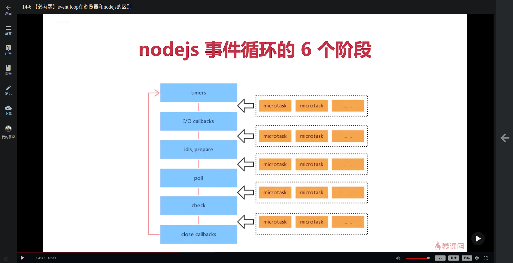

# Node.js 从零开发 Web Server 博客项目 前端晋升全栈工程师必备

## 目录

- [前言](#前言)
- [Node.js-介绍](#node.js-介绍)
- [Node.js-调试之-inspect-协议](#node.js-调试之-inspect-协议)
- [Server-端开发和前端开发的区别](#server-端开发和前端开发的区别)
- [http-概述](#http-概述)
- [路由和-API](#路由和-api)
- [Node.js-连接-MySQL](#node.js-连接-mysql)
- [cookie](#cookie)
  - [cookie-是什么](#cookie-是什么)
  - [cookie-用于登录验证](#cookie-用于登录验证)
  - [对-cookie-做限制](#对-cookie-做限制)
- [session](#session)
- [redis](#redis)
  - [从-session-到-redis](#从-session-到-redis)
  - [redis-简介](#redis-简介)
  - [redis-结合-session](#redis-结合-session)
  - [为什么-session-适合用-redis](#为什么-session-适合用-redis)
  - [为什么网站数据不适合使用-redis](#为什么网站数据不适合使用-redis)
  - [Node.js-连接-redis](#node.js-连接-redis)
- [Nginx](#nginx)
- [MongoDB](#mongodb)
  - [MongoDB-MySQL-Redis-对比](#mongodb-mysql-redis-对比)
  - [MongoDB-重要概念](#mongodb-重要概念)
  - [BSON](#bson)
  - [NoSQL](#nosql)
  - [Node.js-连接-MongoDB](#node.js-连接-mongodb)
  - [mongoose](#mongoose)
- [安全](#安全)
- [日志](#日志)
  - [读写日志](#读写日志)
  - [拆分日志](#拆分日志)
  - [分析日志](#分析日志)
- [常用框架](#常用框架)
  - [Express](#express)
  - [Koa2](#koa2)
- [上线与配置](#上线与配置)
- [Node.js-面试真题讲解](#node.js-面试真题讲解)
  - [Node.js-是什么？和前端-JS-的区别是什么？](#node.js-是什么？和前端-js-的区别是什么？)
  - [Node.js-如何调试？](#node.js-如何调试？)
  - [Node.js-中当前文件和当前目录的路径如何获取？](#node.js-中当前文件和当前目录的路径如何获取？)
  - [commonjs-和-es6 module-的区别？](#commonjs-和-es6-module-的区别？)
  - [path.resolve-和-path.join-的区别？](#path.resolve-和-path.join-的区别？)
  - [事件循环-event-loop-在-nodejs-和浏览器的区别？](#事件循环-event-loop-在-nodejs-和浏览器的区别？)
  - [session-如何实现登录？](#session-如何实现登录？)
  - [如何描述-koa2-和-express-的中间件机制？](#如何描述-koa2-和-express-的中间件机制？)
  - [Node.js-如何读取大文件？](#node.js-如何读取大文件？)
  - [Node.js-线上为何开启多进程？](#node.js-线上为何开启多进程？)

### 前言

Node.js 是一个 JavaScript 的运行环境，主要的用途有两个：

1. 运行在服务器端，作为 Web Server
2. 运行在本地，作为打包、构建工具

其中，第一个场景是最主要的用途，因为只要有项目需要 server 端，就会持续的修改、升级、维护；第二个场景，一般我们会直接使用现成的打包构建工具，而且即使自己实现一个，一但开发完成就会使用很长时间，很少会再去做升级和迭代。

### Node.js-介绍

1. ECMAScript

   定义语法规范，写 JavaScript 和 Node.js 都必须遵守。所谓定义语法，就是规定了例如变量定义、循环、判断、函数、原型和原型链、作用域和闭包、异步等

   ECMAScript 即不能操作 DOM、不能监听事件、不能发送 ajax 请求，也不能处理 http 请求、不能操作文件。也就是说，只有 ECMAScript，几乎做不了任何实际项目

2. JavaScript

   JavaScript 是 ECMAScript 的语法规范，再加上 Web API，二者缺一不可。Web
   API 包含了 DOM 操作、BOM 操作、事件绑定、ajax 等，使用 Web
   API，并且遵守 ES 规范，写出来的代码才能真正在浏览器中运行，完成各种操作

3. Node.js

   Node.js 是 ECMAScript 的语法规范，加上 Nodejs API,二者缺一不可。Nodejs API 包含如处理 http 请求、处理文件等，使用 Nodejs
   API，并且遵守 ES 语法规范，便可以完成 Server 端的任何操作

**总结**：

- ECMAScript 是语法规范
- JavaScript=ECMAScript+Web API
- Node.js=ECMAScript+Nodejs API

### Node.js-调试之-inspect-协议

首先，在使用 node 运行 js 文件时，需要加上“--inspect=9229”，其中 9229 是 inspect 协议的默认端口 i，也可以手动指定

其次，在代码中使用 debugger 打上断点

最后，在 chrome 浏览器地址栏中输入"chrome://inspect"，在打开的页面中，Remote
Target 条目下有 inspect 的链接，点击链接就可以进入 chrome 的调试器开始调试

### Server-端开发和前端开发的区别

Server 端对应着很多个 Client 端，其开发思维和前端开发有所区别，主要在以下几个方面：

1. Server 端要求服务稳定性

   Server 端可能会遭受各种恶意攻击和误操作，单个客户端可以意外挂掉，但是 Server 端不可以，一旦服务挂掉，应该自动重启恢复

2. Server 端要考虑内存和 CPU 的优化与扩展

   Client 端独占浏览器，现今各种设备硬件性能都较强，因此内存和 CPU 都不是问题，即使有一点点内存泄漏或者 CPU 的异常开销都不会有太大问题；Server 因为要承载很多请求，因此内存和 CPU 都是稀缺资源，必须要尽量压榨

3. Server 端需要有日志记录

   前端虽然也会参与写日志，但是只是日志的发起方，不关心后续问题；Server 端则需要通过日志来了解全面的信息，分析掌握如运行情况、性能瓶颈、bug 原因等，所以需要记录日志、拆分日志、存储日志、分析日志。

4. Server 端要求安全性

   Server 端要遭遇各种各样的恶意攻击，前端虽然也要对安全性负责，但是 Server 端具有更大的责任，因为是信息安全的最后一关

5. Server 端需要支持集群和服务拆分

   当产品发展速度快时，流量可能迅速增加，为了承载大流量，需要扩展机器做集群和做服务拆分来应对

### http-概述

_从在浏览器地址栏中输入 url，到显示页面的过程是什么？_

1. DNS 解析，建立 TCP 连接(3 次握手)，发送 http 请求，这是客户端做的
2. Server 端接收 http 请求，处理并返回，这是服务端做的
3. 客户端接收到返回数据，处理数据(如渲染页面、执行 js)，这是客户端做的

### 路由和-API

1. API

   API 主要指多端之间的一个接口，比如前端和后端，子系统和子系统之间。以前端和后端为例，API 就是后端提供的一些列 url，例如“/api/xxx/xx”，以及输入，比如 Get 请求，以及输出，如后端返回数据

2. 路由

   路由有两种意思，一是指 API 的一部分，比如一个 url:“api/xxx/xx”，二是指后端系统内部的一个模块，比如登录模块、操作数据库模块、数据处理模块等

### Node.js-连接-MySQL

1. 安装 mysql 包

   > npm i -S mysql

2. 连接、操作、关闭数据库

```javascript
const mysql = require("mysql");

// 创建连接对象
const con = mysql.createConnection({
  host: "localhost",
  user: "root",
  password: "PASSWORD",
  port: "3306",
  database: "DATABASE",
});

// 连接数据库
con.connect();

// 操作数据库，执行sql语句
con.query(SQL, (err, result) => {
  if (err) {
    console.error(err);
    return;
  }
  console.log(result);
});

// 关闭连接
con.end();
```

### cookie

#### cookie-是什么

1. 存储在浏览器的一串字符串(最大 5kb)
2. 跨域不共享
3. 格式如：k1=v1;k2=v2;k3=v3;因此可以存储结构化数据
4. 每次发送 http 请求，会将请求域的 cookie 一起发送给 server
5. server 可以修改 cookie 并返回给浏览器
6. 浏览器中也可以通过 javascript 修改 cookie，但是有限制

#### cookie-用于登录验证

server 端可以通过 Node.js 查看和修改 cookie，并且设置验证逻辑检测从客户端收到的 cookie，从而实现登录验证

#### 对-cookie-做限制

1. server 端返回 cookie 时，加入"httpOnly"，可以设置只允许 server 端修改 cookie，客户端的修改无效
2. server 端返回 cookie 时，加入"expires="设置 cookie 过期时间

### session

直接使用 cookie 存储用户信息进行登录验证会暴露用户信息，而且客户端 cookie 有存储容量限制，为了解决这些问题，可以使用 cookie 存储无意义的信息，例如用户 id，而真正的用户关键信息是存储在 server 端和 cookie 中的用户 id 一一对应，信息存储在 server 端安全性更高，即使 cookie 中的信息暴露，也只是无意义的信息，而且 server 存储信息没有容量上的限制，这就是**session**解决方案

### redis

#### 从-session-到-redis

在使用 session 时，如果 server 存储的信息是放在 js 文件的变量中的，那么数据是存在与 Node.js 的进程中的，这就产生了两个问题：

1. 系统为每个进程分配的内存是有限的，当访问量过大是，存储在进程内存中的数据两暴增，可能撑爆进程内存
2. 当正式上线时，server 端服务都是多进程运行的，而进程之间是没法共享内存的

为了解决以上问题，可以引入 redis 来存储用户数据

#### redis-简介

1. redis 是 web server 中常用的缓存数据库，数据存储与内存当中
2. 内存的特点之一是访问速度快，内存和硬盘的速度不是一个数量级的，因此 redis 比 mysql 访问速度要快很多
3. 内存的特点之二是价格昂贵，因此容量小，可以存储的数据量也很少，因此 redis 适合存储少量的、经常使用的数据，而 mysql 适合存储大容量的、对访问速度没有较高要求的场景

#### redis-结合-session

使用 redis 记录用户登录信息，可以将数据和 web
server 独立开来，因此不会受进程内存限制，并且多个进程之间可以共享 redis 中存储的数据，当数据量暴增时，可以对 redis 进行扩展，而不影响 web
server

#### 为什么-session-适合用-redis

1. session 访问频繁，对性能有较高要求
2. session 可不考虑断电数据丢失的问题，而这正是内存的硬伤
3. session 中的数据量不会太大

#### 为什么网站数据不适合使用-redis

1. 访问不频繁，对性能没有特别要求
2. 数据需要持久存储，不能断电丢失
3. 数据量太大，使用内存存储成本太高

#### Node.js-连接-redis

1. 安装 redis 包

   > npm i -S redis

2. 连接、操作、关闭 redis

   ```javascript
   const redis = require("redis");

   // 建立连接
   const redisClient = redis.createClient(6379, "127.0.0.1");

   redisClient.on("error", (err) => {
     console.error(err);
   });

   // 存储数据
   redisClient.set("k1", "v1", redis.print);
   // 读取数据
   redisClient.get("k1", (err, val) => {
     if (err) {
       console.error(err);
     }
     console.log(val);
   });

   // 关闭连接
   redisClient.quit();
   ```

### Nginx

Nginx 是一个高性能的 web 服务器，开源免费

Nginx 经常用来做静态服务，即服务器不需要处理直接返回资源

Nginx 常用来做负载均衡，比如有多台 web server 作集群时，怎么分配流量使负载达到最高

Nginx 常用来做代理(正向代理/反向代理)

### MongoDB

MongoDB 是文档数据库，以文档形式存储数据，使用类似 JSON 的 BSON 格式(Binary JSON)

#### MongoDB-MySQL-Redis-对比

- MySQL 是关系型数据库，以表格形式存储数据，使用 SQL 语句操作，数据存储在硬盘中
- Redis 是非关系型数据库，以键-值对形式存储数据，不需要使用 SQL 语句操作，数据存储在内存中
- MongoDB 是非关系型数据库，以文档形式存储数据(使用类似 JSON 格式的 BSON-Binary
  JSON 格式)，不需要使用 SQL 语句操作，数据存储在硬盘中

通过以上的对比可以看出：

在 MongoDB 和 Redis 之间做选择和在 MySQL 与 Redis 之间做选择一样，是硬盘数据库和内存数据库的选择

在 MongoDB 和 MySQL 之间做选择，MySQL 适合存储格式规整的信息，MongoDB 适合存储格式松散的信息，并且 MongoDB 由于不使用 SQL 语句，因此学习成本比 MySQL 低，使用更简单，在不需要存储大量规整数据时，可以优先考虑使用 MongoDB

当数据量大且形式复杂时，可以将 MongoDB 和 MySQL 结合使用，MySQL 存储格式规整的提要信息，MongoDB 存储长篇、松散的具体内容信息

#### MongoDB-重要概念

1. MongoDB 可以成为数据库**系统(服务)**

   MongoDB 是服务层级的而不是功能层级的，一个数据库系统允许对接多个服务，而每个服务就对接一个或多个数据库

2. collection(集合)

   数据库是一个服务(业务)的容器，而一个服务(业务)的数据需要分类管理，collection 就是这个数据分类的容器

3. document(文档)

   collection 也是一个数据容器，而其中的每一条数据就是一个 document(文档)，document 可以被增删改查

#### BSON

MongoDB 使用 BSON 格式存储数据，BSON 即 Binary JSON，JSON 是字符串，而 BSON 类似字符串但是实际上是二进制类型

#### NoSQL

关系型数据库如 MySQL，需要使用 SQL 语句，而 MongoDB 是非关系型数据库，不需要使用 SQL 语句，更易学易用

#### Node.js-连接-MongoDB

1. 安装 mongodb 包:

   > npm i -S mongodb

2. 连接、操作、关闭数据库：

   ```javascript
   const MongoClient = require("mongodb").MongoClient;

   // 连接数据库
   MongoClient.connect(
     "mongodb://localhost:27017",
     {
       // 配置
       useUnifiedTopology: true,
     },
     (err, client) => {
       if (err) {
         console.error(err);
         return;
       }

       // 切换使用数据库
       const db = client.db("dbName");

       // 使用集合
       const dbCollection = db.collection("collectionName");

       // 新增数据(异步操作)
       dbCollection.insertOne(
         {
           // 此处传入单条数据，也可以使用insertMany一次插入多条数据
         },
         (err, result) => {
           if (err) {
             console.error(err);
             return;
           }
           console.log(result);

           // 关闭数据库
           client.close();
         }
       );

       // 删除数据(异步操作)
       dbCollection.deleteOne(
         {
           // 此处传入查询条件指定要删除的数据，也可以使用deleteMany同时删除多条数据
         },
         (err, result) => {
           if (err) {
             console.error(err);
             return;
           }
           console.log(result);

           // 关闭数据库
           client.close();
         }
       );

       // 修改数据(异步操作)
       dbCollection.updateOne(
         {
           // 此处传入查询条件指定修改哪条数据，也可以使用updateMany同时修改多条数据
         },
         {
           // 此处指定要修改的值，注意要使用$set
           $set: { key: "value" },
         },
         (err, result) => {
           if (err) {
             console.error(err);
             return;
           }
           console.log(result);

           // 关闭数据库
           client.close();
         }
       );

       // 查询数据(异步操作)
       dbCollection
         .find({
           // 此处可以选择传入查询条件，对数据进行过滤
         })
         .toArray((err, result) => {
           if (err) {
             console.error(err);
             return;
           }
           console.log(result);

           // 关闭数据库
           client.close();
         });
     }
   );
   ```

#### mongoose

为什么要使用 mongoose？因为 mongodb 数据格式过于灵活，可以插入任何数据不受限制，而实际开发项目时要有数据格式的规范(很重要)，特别是多人协作开发时。mongoose 提供了 schema 和 model 来规范 mongodb 数据格式。

使用 mongoose 并不是要将 mongodb 变得和 mysql 一样，使用 mongoose 只是使用层面的调整，不是 mongodb 的初衷，这种方式适合于以格式松散数据为主，少量格式规范数据的情景，如果业务数据以大量格式规范数据为主，则应该直接使用 mysql

mongoose 主要为 mongodb 存储的数据提供规范，通过 Schema 定义数据格式的规范，以 Model 规范 Collection，规范数据操作的 API

mongoose 的使用：

1. 安装 mongoose 包：

   npm i -S mongoose

2. 使用 mongoose：

   ```javascript
   const mongoose = require("mongoose");

   // 连接
   mongoose.connect(`${"mongodb://localhost:27017"}/${"dbName"}`, {
     // 配置
     useUnifiedTopology: true,
     useNewUrlParser: true,
   });

   // 使用数据库
   const db = mongoose.connection;

   db.on("error", (err) => {
     console.error(err);
     return;
   });

   db.once("open", () => {
     console.log("mongodb connect success");
   });

   // 使用Schema定义数据规范
   const schema = mongoose.Schema({
     // 此处传入数据规范
   });

   // Model对应Collection
   const model = mongoose.model("collectionName", schema);

   // 使用Model执行数据的增删改查

   // 自执行的异步函数
   !(async () => {
     // 新增数据
     const result = await model.create({
       // 此处传入数据
     });

     // 删除数据
     const resultDeleted = model.findOneAndDelete({
       // 查询条件，指定要删除的数据
     });

     // 修改数据
     const resultModified = model.findOneAndUpdate(
       {
         // 查询条件，指定要修改的数据
       },
       {
         // 新数据
       },
       {
         // 配置
         new: true, // 默认为false，会返回修改前的值，设为true会返回修改后的值
       }
     );

     // 查询数据
     const list = await model.find({
       // 此处可以选择传入查询条件，对数据进行过滤
       // 也可以使用findById通过id查询数据，返回的是单条数据对象
     });
   })();
   ```

### 安全

server 端的攻击方式非常多，以下列举几种常见的，可以通过 Web Server(Node.js)层面预防的安全问题

1. SQL 注入：

   sql
   注入主要目的是窃取数据库内容。sql 注入是一种最原始、最简单的攻击，从 web2.0 时代开始出现，此时互联网和用户之间开始有了交互。sql 注入的攻击方式是输入的是一个 sql 片段，而最终到了 server 端执行时和执行语句拼接成了一段攻击代码。预防措施就是使用 mysql 的 escape 函数对用户输入进行处理后，在执行数据库操作。

2. XSS 攻击：

   xss 攻击主要目的是窃取前端
   cookie。xss 的攻击方式是在输入中掺杂 js 代码，从而获取网页信息。预防措施就是对 js
   中的特殊字符进行转义，可以直接使用 npm 安装 xss 来实现

3. 密码加密：

   密码加密一般在前端涉及不到，主要在 server
   端使用，目的是为了保障用户信息安全。这类攻击主要是通过获取用户名和密码再去尝试登录其他系统，预防措施就是将密码加密，即使密码泄漏也不知道明文，无法使用，可以通过 Node.js 自带的 crypto 包来实现

### 日志

如果 Web Server 没有日志，就好像人没有眼睛一样，无法了解系统中发生了什么，常见的日志主要有：

1. access log 访问日志，这是 server 端最重要的日志
2. 自定义日志，主要是自定义事件、错误记录等，不会像访问日志一样，每次 http 请求都会产生，自定义日志只有在指定的情况发生时才会产生

日志一般以文本格式存储，因为文本格式在任何服务器上都支持，不需要特定的运行环境。日志不使用 mysql 存储主要是因为日志是一条一条的记录，分析时是逐行读取的，而 mysql 适合的是表结构的数据。日志不使用 redis 是因为读写日志并没有性能上的高要求，而且日志会随着运行时间逐渐增大，不适合使用昂贵的内存存储。

#### 读写日志

I/O 操作相对与 cpu 计算和内存读写来说非常慢，为了突破 IO 操作的性能瓶颈，需要采用 stream-流的方式读写文件

#### 拆分日志

日志随着时间会慢慢积累，放在一个文件中不合适，可以按一定规则划分日志，比如按时间，可以通过 linux 的 crontab 命令设置定时任务实现

#### 分析日志

日志是按行存储的，一行就是一条日志，因此可以使用 Node.js 自带的 readline 进行读取，readline 是基于 stream 的，效率很高

### 常用框架

#### Express

express 中使用 app.use 注册中间件，先将所有中间件收集起来。当遇到 http 请求时，根具 path 和 method 来判断要触发哪些中间件，接着通过 next 机制，即上一个中间件通过 next 触发下一个，这样层层触发所有符合的中间件，在依次返回(洋葱圈模型)

express 使用回调函数处理异步操作，而 Node.js 已经全面支持 async/await 语法，较新的 Koa2 框架中就使用了 async/await 处理异步

#### Koa2

koa2 中的中间件原理和 express 基本一样，区别在于使用了新的 async/await 语法来处理异步

### 上线与配置

线上环境的特点：

- 服务器稳定性
- 充分利用服务器硬件资源，以便提高性能
- 线上日志记录

针对线上环境特点，可以使用 PM2 来上线运行，PM2 具有：

- 进程守护功能，系统崩溃自动重启
- 启动多进程功能，充分利用 CPU 和内存
- 日志记录功能

安装 PM2：

> npm i -g pm2

使用 PM2：

> 使用 pm2 start 启动入口 js 文件
>
> 使用 pm2 list 显示进程列表
>
> 使用 pm2 restart AppName 或 id 重启进程
>
> 使用 pm2 stop AppName 或 id 停止进程
>
> 使用 pm2 delete AppName 或 id 删除进程
>
> 使用 pm2 info AppName 或 id 显示进程详细信息
>
> 使用 pm2 log AppName 或 id 查看进程日志
>
> 使用 pm2 monit AppName 或 id 查看进程的 CPU 信息和内存信息等

进程守护是 PM2 的核心功能，当使用 node 或者 nodemon 启动进程时，进程崩溃则不能访问，而使用 pm2 启动进程，遇到进程崩溃时会自动重新启动

PM2 可以通过配置文件设定进程数量、日志文件目录等，在 PM2 的启动命令中可以指定配置文件

PM2
可以启动多进程，那么为什么在线上运行是要使用多进程？因为操作系统为每个进程分配的内存是有限的，为了尽可能压榨服务器的能力，只有通过启动多进程才可以实现，而且多进程也增加了服务的稳定性。但是多进程也有缺点，那就是多个进程之间内存无法共享，解决办法就是配合使用 redis，多个进程访问一个 redis，实现数据共享

### Node.js-面试真题讲解

#### Node.js-是什么？和前端-JS-的区别是什么？

Node.js 是基于 Chrome
V8 引擎的 JavaScript 运行时，nodejs 出现之前，js 只能运行在浏览器中，nodejs 出现之后，js 可以在任何安装了 nodejs 的环境中运行。

Node.js 和 JS 都使用了 ES 的语法，nodejs 使用 node API 实现，前端 JS 使用 web API 实现。Node.js 可以用于服务端，如开发 Web
Server，也可以用于本机，如 webpack，前端 JS 用于网页，在浏览器中运行。

#### Node.js-如何调试？

可以使用 inspect 协议调试，在启动 nodejs 服务时，使用 inspect 参数，在代码中使用 debugger 打上断点，在 chrome 中访问 chrome://inspect 开始调试。

#### Node.js-中当前文件和当前目录的路径如何获取？

使用**filename 和**dirname，两个都是全局变量。

#### commonjs-和-es6-module-的区别？

1. 语法不同
2. commonjs 是动态引入，执行时引入，放在块作用域中不会报错
3. es6 module 是静态引入，编译时引入，必须放在代码最顶层，否则会报错
4. es6 module 支持 tree shaking

#### path.resolve-和-path.join-的区别？

两者都用于拼接文件路径。path.resolve 获取绝对路径，path.join 获取相对路径。

#### 事件循环-event-loop-在-nodejs-和浏览器的区别？

1. 浏览器中 js 的异步分为宏任务(setTimeout setInterval ajax 等)和微任务(promise async/await
   等)，微任务比宏任务更早执行。

   当浏览器执行脚本时，首先将同步任务按顺序放入 call stack 中并依次执行，异步任务放入 callback queue 中等待执行，当 call stack 空闲时，浏览器首先尝试 DOM 渲染，完成之后触发 event loop，将 callback queue 中的异步任务放入 call stack 中开始执行，微任务比宏任务先执行。

2. nodejs 中也有同浏览器中一样的宏任务(setTimeout setInterval 等)以及微任务(promise
   async/await 等)，还有 nodejs 中特有的宏任务 setImmediate,I/O 文件，网络，Socket 连接(如连接 mysql)等，以及特有的微任务 process.nextTick

   nodejs 中也是先执行同步任务，然后执行微任务，完成之后在执行宏任务，如此循环，和浏览器中一样，但是和浏览器相比，nodejs 中微任务不多，宏任务类型较多，如果所有宏任务都放在一个 callback
   queue 中，不好管理，因此 nodejs 中 event loop 分成了 6 个阶段，如下图所示：

   

   1. timers：执行 setTimeout 和 setInterval 的回调
   2. I/O callbacks：处理网络、流、TCP 的错误回调
   3. idle、prepare：闲置阶段，nodejs 内部使用
   4. poll：执行 poll 中的 I/O 队列，检查定时器是否到时间
   5. check：存放 setImmediate 回调
   6. close callbacks：关闭回调，例如 Socket.on('close')

   **_注意：每次执行宏任务之前，都要先执行完当前的微任务_**，所有微任务中，process.nextTick 的优先级最高，但是已经不推荐使用，因为会阻塞 I/O

   setTimeout 比 setImmediate 执行更早，process.nextTick 比 promise.then 执行更早，另外建议用 setImmediate 代替 process.nextTick

#### session-如何实现登录？

1. 使用 cookie 实现登录验证，缺点是容易泄漏信息
2. 使用 cookie 存储例如用户 id 之类的无意义数据，真实的数据存储在服务器中和 cookie 中的标识一一对应，解决了 cookie 的安全性问题，这就是 session 解决方案
3. 单个进程有内存限制，多个进程之间又相互隔离，于是将 session 中的数据存储到 redis 中，以实现多进程之间数据共享

#### 如何描述-koa2-和-express-的中间件机制？

- 从代码中来看，中间件就是一个函数
- 从业务层面来看，中间件是一个独立的模块
- 通过模块拆分、模块流转，就可以完成复杂的功能

#### Node.js-如何读取大文件？

使用基于 stream(流)的方式，提高性能，突破 I/O 瓶颈，在读取日志时可以使用 nodejs 自带的 readline 通过流的方式逐行读取文件

#### Node.js-线上为何开启多进程？

- 高效使用 CPU
- 充分利用服务器内存
- 最终目的是压榨服务器，不浪费资源
